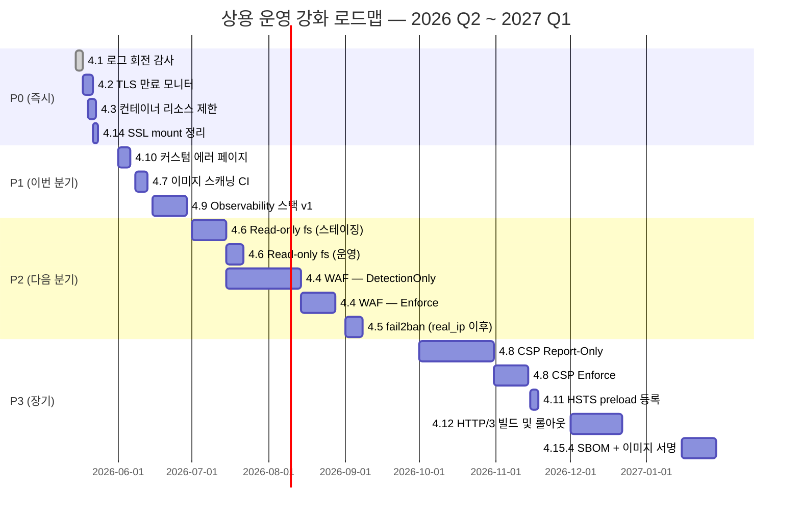

# [OPS-GUIDE-001] Nginx 상용 운영 강화 가이드 — Master Index

| 항목 | 값 |
| --- | --- |
| 문서 ID | OPS-GUIDE-001 |
| 시리즈명 | Nginx Production Hardening |
| 생성일 | 2026-05-15 |
| 최근 검토일 | 2026-05-15 |
| 소유자 | Infrastructure / SRE |
| 상태 | Living document — 매 분기 또는 운영 사고 직후 review |
| 적용 범위 | `devspoon-web`, `devspoon-startup-{web,tizen,cloud-tizen}` 의 nginx fleet |
| 독자 | SRE, 인프라 엔지니어, 온콜, 보안 엔지니어 |
| 사전 학습 자료 | `devspoon-web/README.md` §3.5 (ngxblocker), `devspoon-web/config/web-server/nginx/*/nginx_conf/nginx.conf` 의 인라인 주석 (rate-limit 정책, real_ip 활성화 가이드) |

## 시리즈 구성 (이 문서는 인덱스)

| 시리즈 번호 | 문서 제목 | 다루는 영역 |
| --- | --- | --- |
| **OPS-GUIDE-001** | Master Index *(이 문서)* | 위협 모델, 우선순위 매트릭스, 로드맵, 공통 롤백, 시리즈 인덱스 |
| **OPS-GUIDE-002** | [TLS / 인증서 운영](./2026-05-15-OPS-GUIDE-002-tls-certificate-lifecycle.md) | 인증서 만료 모니터링, HSTS preload, Let's Encrypt 계정 백업 |
| **OPS-GUIDE-003** | [애플리케이션 계층 방어](./2026-05-15-OPS-GUIDE-003-application-layer-defense.md) | WAF (ModSecurity + OWASP CRS), fail2ban, CSP 단계적 도입 |
| **OPS-GUIDE-004** | [컨테이너 / 이미지 보안](./2026-05-15-OPS-GUIDE-004-container-and-image-security.md) | 리소스 제한, read-only filesystem, 이미지 취약점 스캐닝, SBOM/서명, egress 필터링, 백엔드 격리 |
| **OPS-GUIDE-005** | [운영 가시성 / 로그 / 메트릭](./2026-05-15-OPS-GUIDE-005-observability-and-operations.md) | 로그 회전, Observability 스택, 커스텀 에러 페이지, 감사 로그 immutability, secrets 관리, 백업/DR |
| **OPS-GUIDE-006** | [엣지 / 네트워크](./2026-05-15-OPS-GUIDE-006-edge-and-network.md) | HTTP/3, real_ip, SSL mount 범위, Slowloris, CONTINUATION flood, DDoS playbook |

> **읽는 순서.** 우선 본 문서의 §2 (Executive Summary) 와 §6 (우선순위 매트릭스) 를 빠르게 훑어 "이번 주에 무엇을 할 것인가 vs 이번 분기에 무엇을 할 것인가" 를 파악하세요. 그 다음 해당 항목을 다루는 sub-guide 로 들어가서 본격적인 작업을 시작합니다. 각 sub-guide 의 "흔히 빠지는 함정" 절은 절대 건너뛰지 마세요 — 다른 곳에서 이미 일어난 장애가 그 안에 압축되어 있습니다.

---

## 1. 표기 규칙

- **`<svc>`** — 백엔드 종류 marker: `gunicorn` | `uwsgi` | `php`.
- **컨테이너 이름 패턴** — `nginx-<svc>-webserver`.
- **Compose 경로 패턴** — `compose/web_service/nginx_<svc>/`.
- **Sample 경로** — `config/web-server/nginx/<svc>/sample_nginx{,_https,_proxy,_proxy_https}.conf`.
- **심각도 (Severity)** — Critical / High / Medium / Low. Critical 은 단일 컨트롤 실패가 곧 사용자에게 보이는 장애 또는 기밀 유출로 직결되는 등급. High 는 점진적 비용 증가 또는 반복적 부분 장애. Medium / Low 는 quality-of-life 또는 defense-in-depth.
- **공수 (Effort)** — XS (<1시간) / S (<1일) / M (<1주) / L (<1개월) / XL (다분기).
- **되돌림 가능성 (Reversibility)** — Reversible (config 변경, reload 한 번) / Hard-to-reverse (이미지 재빌드 + 다운타임) / Irreversible (HSTS preload 등록, 공개 CT 로그 게재).

---

## 2. Executive Summary

본 시리즈가 작성될 시점의 fleet 은 2024~2026 년 트래픽 패턴에서 관측된 기회주의적 위협의 대부분을 흡수할 수 있는 defense-in-depth 의 기초 layer 들을 이미 갖추고 있습니다.

- **봇 차단은 `nginx-ultimate-bad-bot-blocker` (ngxblocker)** 에 위임되어 6시간 단위 cron 자동 갱신이 동작 중이며, 본 시점 globalblacklist.conf 는 7,851개 이상의 regex map entry 를 포함.
- **봇만 throttle** 되는 구조 — `bots.d/ddos.conf` 의 `limit_conn addr` / `limit_req zone=flood` directive 는 `$bot_iplimit` key 를 사용. 이 변수는 `$bad_bot` 이 truthy 일 때만 `$binary_remote_addr` 로 채워지므로 정상 사용자 트래픽은 limit 적용 대상에서 자동 제외됨.
- **SNI 미일치 트래픽은 TLS handshake 단계에서 거부** — 443 포트의 `ssl_reject_handshake on;` 이 빌드 시 자동 생성된 dummy 인증서 (`/etc/nginx/ssl/default/`) 와 함께 동작하여, 명시적 HTTPS default_server 가 없는 nginx host 에서 흔히 발생하는 인증서 CN/SAN 정보 누출을 차단.
- **TLS 프로파일** — TLSv1.2 + TLSv1.3 만 허용, AEAD-only 암호 (ECDHE-{ECDSA,RSA}-AES{128,256}-GCM-SHA{256,384}, CHACHA20-POLY1305), OCSP stapling, 50 MB 세션 캐시, 세션 티켓 비활성 — **Mozilla Intermediate** 프로파일과 일치.
- **헤더 버퍼와 타임아웃** (client_header_timeout=15s, client_body_timeout=15s, send_timeout=15s, large_client_header_buffers 4×16k) 으로 nginx 계층의 Slowloris/slow-POST 기초 방어.

본 시리즈는 2026 년 5월 review 에서 식별된 14개 강화 항목을 실행 가능한 runbook 으로 확장합니다. 각 항목은 **근거(Why) → 현재 상태(Current state) → 구현 단계와 설정 스니펫(Implementation) → 검증 방법(Testing) → 모니터링 / 알림 hook(Monitoring) → 롤백 절차(Rollback) → 흔히 빠지는 함정(Common pitfalls)** 의 7개 하위 절로 구성됩니다. 모든 항목은 적합한 sub-guide (OPS-GUIDE-002~006) 에 배치되어 있습니다.

본 마스터 문서는 다음을 책임집니다:
- 위협 모델과 defense-in-depth 의 큰 그림 (§3)
- 14 항목의 한 줄 요약과 각 sub-guide 로의 진입 (§4)
- Risk-Effort 우선순위 매트릭스와 분기별 로드맵 (§5, §6)
- 모든 항목에 공통되는 롤백 패턴 (§7)
- 시리즈 전체에서 참조하는 외부/내부 자료 (§8)
- 살아 있는 문서로 유지하기 위한 review/update 정책 (§9)
- 변경 이력 (§10)

---

## 3. 위협 모델 및 Defense-in-Depth

컨트롤을 논하기 전에 먼저 본 fleet 이 실제로 흡수해야 하는 위협 클래스를 열거하는 것이 중요합니다. 엔지니어링 팀은 종종 빈도 낮은 위협에 과잉 투자하고 빈도 높은 위협을 무방비로 둡니다.

### 3.1 빈도별 위협 분류

| 빈도 | 위협 클래스 | 현재 스택의 1차 컨트롤 |
| --- | --- | --- |
| **상시 (≥1 req/s)** | 일반 봇 크롤러 (Ahrefs, Semrush, MJ12, BLEX, scraper) | ngxblocker `blockbots.conf` + `bots.d/ddos.conf` |
| **상시** | 취약점 스캐너 (Acunetix, Nikto, ZmEu, sqlmap UA, masscan) | ngxblocker UA map |
| **빈번 (일 단위)** | SNI-less probing, IP 직접 HTTPS | `ssl_reject_handshake` default_server |
| **빈번** | 일반 경로 probing (`/wp-login.php`, `/.env`, `/admin`, `/phpmyadmin`) | `location ~* \.(env\|conf\|sql\|...)$` deny + `location ~ /\.` deny |
| **간헐** | 회전 IP + 정상 UA 의 분산 저-RPS scraper | 부분 — ngxblocker 가 놓칠 수 있음; §4.4 (WAF), §4.5 (fail2ban) 로 보강 |
| **간헐** | Slow-loris / slowhttptest | client_*_timeout 15s — 단 본격 profiling 미수행 (§4.15) |
| **표적 (드뭄)** | OWASP Top-10 application layer (SQLi, XSS, SSRF, LFI, path traversal) | **현재 스택은 미커버** — 애플리케이션 책임; §4.4 참조 |
| **표적 (드뭄)** | 인증 엔드포인트 credential stuffing / brute-force | **미커버** — §4.5 참조 |
| **재앙적** | 볼류메트릭 L3/L4 DDoS (Tbps SYN flood, UDP amp) | nginx 범위 밖 — 상위 (CDN / scrubbing center / 클라우드) 가 처리 |
| **재앙적** | base image 또는 ngxblocker 업스트림의 공급망 침해 | 부분 — §4.7 이미지 스캐닝 + §4.16 공급망 강화 |

### 3.2 Defense-in-depth 계층 구성

현재 설정은 다음 순서로 계층화된 방어를 달성합니다. 각 후속 계층은 이전 계층이 실패할 수 있다고 가정합니다.

1. **L7 엣지 필터** — ngxblocker UA / referer / IP map 이 `$bad_bot` 을 결정.
2. **L7 hard block** — `blockbots.conf` 가 `$bad_bot` truthy 일 때 444 (TCP close, no response body) 반환.
3. **L7 봇 throttle** — `ddos.conf` 가 `$bot_iplimit` key (봇 매칭일 때만 non-empty) 로 `limit_conn` / `limit_req` 적용.
4. **경로 기반 차단** — hidden 파일과 민감 확장자에 명시적 `deny all`.
5. **TLS 종단** — TLS 1.2/1.3 + AEAD 암호 + OCSP stapling.
6. **SNI catch-all** — `ssl_reject_handshake` 가 SNI 미매칭 handshake 를 거부.
7. **HTTP catch-all** — 80/tcp default_server 의 `return 444` 가 미상 Host 헤더 트래픽을 즉시 종료.

이 계층화로 **커버되지 않는** 영역은 §4 에서 강조됩니다.

---

## 4. 14 강화 항목 요약 및 sub-guide 매핑

각 항목의 본문 (Why / 현재 상태 / 구현 / 검증 / 모니터링 / 롤백 / 함정) 은 매핑된 sub-guide 에 있습니다. 본 마스터에서는 한 줄 요약과 진입점만 제공합니다.

| § | 항목 | 심각도 | 공수 | 위치 |
| --- | --- | --- | --- | --- |
| 4.1 | 로그 회전(logrotate) 작동 검증 및 강화 | Critical | S | [OPS-GUIDE-005 §1](./2026-05-15-OPS-GUIDE-005-observability-and-operations.md#1-로그-회전logrotate-작동-검증-및-강화) |
| 4.2 | TLS 인증서 lifecycle / 만료 모니터링 | Critical | S | [OPS-GUIDE-002 §1](./2026-05-15-OPS-GUIDE-002-tls-certificate-lifecycle.md#1-tls-인증서-lifecycle-및-만료-모니터링) |
| 4.3 | 컨테이너 리소스 제한 | High | XS | [OPS-GUIDE-004 §1](./2026-05-15-OPS-GUIDE-004-container-and-image-security.md#1-컨테이너-리소스-제한) |
| 4.4 | WAF (ModSecurity + OWASP CRS) | High | M~L | [OPS-GUIDE-003 §1](./2026-05-15-OPS-GUIDE-003-application-layer-defense.md#1-웹-애플리케이션-방화벽-waf) |
| 4.5 | fail2ban 통합 | High | M | [OPS-GUIDE-003 §2](./2026-05-15-OPS-GUIDE-003-application-layer-defense.md#2-fail2ban-통합) |
| 4.6 | Read-only root filesystem | Medium | M | [OPS-GUIDE-004 §2](./2026-05-15-OPS-GUIDE-004-container-and-image-security.md#2-read-only-root-filesystem) |
| 4.7 | 이미지 취약점 스캐닝 | Medium | S + 운영 비용 | [OPS-GUIDE-004 §3](./2026-05-15-OPS-GUIDE-004-container-and-image-security.md#3-이미지-취약점-스캐닝) |
| 4.8 | Content Security Policy 단계적 강화 | Medium | M (수개월) | [OPS-GUIDE-003 §3](./2026-05-15-OPS-GUIDE-003-application-layer-defense.md#3-content-security-policy-단계적-강화) |
| 4.9 | Observability — 메트릭/로그/트레이스 | High | M | [OPS-GUIDE-005 §2](./2026-05-15-OPS-GUIDE-005-observability-and-operations.md#2-observability--메트릭-로그-트레이스) |
| 4.10 | 커스텀 에러 페이지 | Low | XS | [OPS-GUIDE-005 §3](./2026-05-15-OPS-GUIDE-005-observability-and-operations.md#3-커스텀-에러-페이지) |
| 4.11 | HSTS preload 등록 | Medium | XS (결정) + 비가역 | [OPS-GUIDE-002 §2](./2026-05-15-OPS-GUIDE-002-tls-certificate-lifecycle.md#2-hsts-preload-등록) |
| 4.12 | HTTP/3 (QUIC) 도입 | Low (성능) | M | [OPS-GUIDE-006 §1](./2026-05-15-OPS-GUIDE-006-edge-and-network.md#1-http3-quic-도입) |
| 4.13 | real_ip 활성화 | Critical (LB 뒤일 때) | XS | [OPS-GUIDE-006 §2](./2026-05-15-OPS-GUIDE-006-edge-and-network.md#2-real_ip-활성화) |
| 4.14 | SSL mount 범위 정리 | Low | S | [OPS-GUIDE-006 §3](./2026-05-15-OPS-GUIDE-006-edge-and-network.md#3-ssl-mount-범위-정리) |

추가 brief 항목 (§4.15.x) 은 각 sub-guide 의 보조 절에 배치되어 있습니다 (예: Slowloris 하드닝 → OPS-GUIDE-006, 감사 로그 immutability → OPS-GUIDE-005, SBOM/서명 → OPS-GUIDE-004).

---

## 5. 운영 워크플로우 (개요)

본 시리즈에는 4개의 핵심 운영 워크플로우 시퀀스 다이어그램이 분산되어 있습니다. 본 인덱스에서는 어디에 위치하는지만 안내합니다.

| 워크플로우 | 위치 |
| --- | --- |
| ngxblocker 자동 갱신 + 안전한 reload | [OPS-GUIDE-005 §4.1](./2026-05-15-OPS-GUIDE-005-observability-and-operations.md#41-ngxblocker-자동-갱신--안전한-reload) |
| TLS 인증서 갱신 + 실패 알림 | [OPS-GUIDE-002 §3.1](./2026-05-15-OPS-GUIDE-002-tls-certificate-lifecycle.md#31-tls-인증서-갱신--실패-알림-에스컬레이션) |
| real_ip 활성화 단계적 롤아웃 | [OPS-GUIDE-006 §4.1](./2026-05-15-OPS-GUIDE-006-edge-and-network.md#41-real_ip-활성화-단계적-롤아웃) |
| 로그 회전 검증 1회성 감사 | [OPS-GUIDE-005 §4.2](./2026-05-15-OPS-GUIDE-005-observability-and-operations.md#42-로그-회전-검증-1회성-감사) |

---

## 6. 우선순위 매트릭스 및 도입 로드맵

### 6.1 Risk-Effort 우선순위 매트릭스

아래 매트릭스는 항목을 **위험도 (Risk — 현재 상태에서 해당 컨트롤이 막아주는 실패 모드의 심각도)** 와 **공수 (Effort — 안정 상태에 도달하는 데 필요한 엔지니어링 시간)** 두 축으로 평가합니다. 우상단 분면 (High Risk × Low Effort) 이 가장 leverage 높은 작업입니다.

```
                    LOW EFFORT (XS-S)              HIGH EFFORT (M-L)
                ┌──────────────────────────────┬─────────────────────────────┐
                │                              │                             │
                │   4.1 로그 회전 감사         │   4.4 WAF                   │
   CRITICAL     │   4.2 TLS 만료 모니터        │   4.5 fail2ban              │
   RISK         │   4.3 컨테이너 리소스 제한   │                             │
                │   4.13 real_ip (LB 뒤일 때)  │                             │
                │                              │                             │
                ├──────────────────────────────┼─────────────────────────────┤
                │                              │                             │
                │   4.7 이미지 스캐닝(CI)      │   4.6 Read-only filesystem  │
   HIGH         │   4.10 커스텀 에러 페이지    │   4.8 CSP 단계적 강화       │
   RISK         │   4.11 HSTS preload          │   4.9 Observability 스택    │
                │   4.14 SSL mount 정리        │                             │
                │                              │                             │
                ├──────────────────────────────┼─────────────────────────────┤
                │                              │                             │
                │   4.15.2 HTTP/2 CONT flood   │   4.12 HTTP/3 QUIC          │
   MEDIUM       │   4.15.3 LE 계정 백업        │   4.15.4 SBOM / 이미지 서명 │
   RISK         │                              │   4.15.5 Egress 필터링      │
                │                              │   4.15.10 DDoS playbook     │
                │                              │                             │
                └──────────────────────────────┴─────────────────────────────┘
```

### 6.2 분기별 도입 로드맵



### 6.3 운영 컨텍스트별 우선순위 재정렬

위 매트릭스는 일반적인 상용 배포를 가정합니다. 운영 컨텍스트에 따라 재정렬:

| 컨텍스트 | 재정렬 |
| --- | --- |
| **CDN (CloudFlare 등) 뒤** | §4.13 real_ip 즉시. §4.4 WAF 우선순위 ↓ (CDN 이 이미 제공). §4.5 fail2ban 은 real_ip 이후. §4.12 HTTP/3 우선순위 ↓ (CDN 이 엣지 담당). |
| **직접 인터넷 노출** | §4.4 WAF 우선순위 ↑. §4.15.10 DDoS playbook 중요. §4.11 HSTS preload 는 안정화 이후. |
| **PCI-DSS / SOC2 범위** | §4.7 이미지 스캐닝 필수 (선택 아님). §4.15.7 감사 로그 immutability 필수. §4.15.8 secrets 관리 필수. |
| **고트래픽 / 모바일 집중** | §4.12 HTTP/3 우선순위 ↑. §4.9 Observability + p99 latency tracking 필수. |
| **다중 리전 active-active** | §4.9 Observability 의 region 단위 SLO. §4.15.9 백업 / DR + cross-region replication. |

### 6.4 완료 판정 기준 (Acceptance Criteria)

| 항목 | "완료" 판정 조건 |
| --- | --- |
| 4.1 로그 회전 | 운영에서 30일 연속 자동 회전 관측, postrotate USR1 동작 검증 |
| 4.2 TLS 만료 | 독립 모니터 가동 AND deploy/post-hook 이 Slack 으로 전송 AND 테스트 알림 발사 확인 |
| 4.3 컨테이너 제한 | 모든 compose 파일이 컨테이너마다 `mem_limit` 와 `cpus` 명시, mem >85% alert 활성 |
| 4.4 WAF | Enforce 모드 4주 이상 + false positive < 0.5% + 감사 로그 색인/쿼리 가능 |
| 4.5 fail2ban | banned-IP 메트릭 노출, false positive < 1%, unban runbook 검증 |
| 4.6 Read-only fs | 모든 컨테이너 `read_only: true`, certbot/ngxblocker 정상 동작, escape 테스트가 의도대로 실패 |
| 4.7 이미지 스캐닝 | CI 가 Critical CVE 도입 PR 을 차단, 주간 스캔 무인 운영, 월간 triage backlog ≤ 10 |
| 4.8 CSP | Enforce 모드 + `script-src` / `style-src` 정의 + script-src 위반의 ≥95% 해결 |
| 4.9 Observability | Grafana dashboard 가동, 8개 starter alert 가 chaos test 에서 실제 발사 |
| 4.10 에러 페이지 | 커스텀 404/5xx 페이지가 이미지에 bundle, 외부에서 curl 검증 시 응답에 "nginx" 문자열 없음 |
| 4.11 HSTS preload | https://hstspreload.org 에서 도메인 상태가 등록 완료로 표시 AND `chrome://net-internals/#hsts` 에서 확인 |
| 4.12 HTTP/3 | `curl --http3` 성공, Alt-Svc 광고, 모바일 트래픽의 ≥30% upgrade 측정 |
| 4.13 real_ip | access 로그에 실제 클라이언트 IP, `awk '{print $1}' \| sort \| uniq` 에서 LB IP 가 entry 의 1% 미만 |
| 4.14 SSL mount | 호스트 `ssl/certs/` 디렉터리가 비어있거나 존재하지 않음, 컨테이너 outbound TLS 정상 |

---

## 7. 공통 롤백 패턴

config 또는 이미지 변경이 포함된 모든 항목에는 롤백 절차가 문서화되고 테스트되어야 합니다. 공통 형태:

```
1. 변경 commit hash 를 git revert 한다.
2. (이미지 변경이라면) 재빌드 및 태그 부여.
3. docker compose up -d --force-recreate webserver.
4. forward migration 에서 사용한 동일 테스트로 검증.
5. #ops 채널에 롤백 사실을 타임스탬프와 사유와 함께 공유.
```

비가역적 항목 (HSTS preload 등록, 공개 CT 로그 게재) 은 롤백이 없습니다 — 오직 forward-fix 경로만 존재합니다. 이런 항목은 §6.1 의 비가역성 표시로 강조되며, 해당 수준의 신중함을 가지고 다루어야 합니다.

---

## 8. References

본 시리즈가 참조하는 외부 문서:

- **nginx 공식 문서** — https://nginx.org/en/docs/
- **Mozilla SSL Configuration Generator** — https://ssl-config.mozilla.org/ — 현재 TLS 프로파일의 기준 (Intermediate, nginx 1.27, OpenSSL 3.0.x).
- **OWASP CRS** — https://coreruleset.org/ — OPS-GUIDE-003 의 WAF 룰셋 출처.
- **CIS Docker Benchmark** — OPS-GUIDE-004 (리소스 제한, read-only fs) 의 기준.
- **nginx-ultimate-bad-bot-blocker** — https://github.com/mitchellkrogza/nginx-ultimate-bad-bot-blocker — ngxblocker 의 업스트림.
- **Let's Encrypt rate limits** — https://letsencrypt.org/docs/rate-limits/
- **HSTS preload 등록** — https://hstspreload.org/
- **report-uri.com** — https://report-uri.com/ — CSP 위반 수집 서비스.
- **Trivy** — https://aquasecurity.github.io/trivy/ — 이미지 취약점 스캐너.

내부 참조 문서:

- `devspoon-web/README.md` — 프로젝트 주 문서.
- `devspoon-web/script/test/verify-ngxblocker.sh` — ngxblocker 종단간 검증 harness; sub-guide 의 검증 절차에서 사용.
- `devspoon-web/config/web-server/nginx/<svc>/nginx_conf/nginx.conf` — rate-limit 정책 (OPS-GUIDE-006 §2 의 사전 학습 자료) 과 real_ip 활성화 인라인 가이드 주석 포함.

---

## 9. Review / Update 정책

본 시리즈는 living document 입니다. 변경 없이 방치되면 빠르게 진실과 괴리됩니다. 다음 정책을 따릅니다.

### 9.1 정기 review

| 주기 | 책임자 | 검토 범위 |
| --- | --- | --- |
| **분기 (3개월)** | SRE 리드 | 본 마스터 §3 위협 모델, §6 우선순위 매트릭스. 새 위협 클래스가 등장했는지 / 항목의 위험도가 변경되었는지 / 완료된 항목을 매트릭스에서 archive 할지 검토. |
| **분기** | 각 sub-guide 소유자 | 자신의 sub-guide 의 본문 — 설정 스니펫이 현재 운영중인 버전과 일치하는지, "흔히 빠지는 함정" 절에 새로 발견된 사고를 추가할지. |
| **반기 (6개월)** | 보안 엔지니어 | §8 References 의 외부 자료 — 버전 변경, 새 권장사항 반영. CIS 벤치마크 / OWASP 가이드의 신버전. |
| **연간** | 인프라 리드 | §6.2 로드맵 — 다음 12개월 계획 갱신. 완료된 항목은 §10 Change Log 에 정리하고 새 항목 추가. |

### 9.2 이벤트 기반 review (사고 직후)

- **운영 사고 발생 시**: 사고가 어떤 §4.x 항목과 매핑되는지 분석 후 해당 sub-guide 의 "흔히 빠지는 함정" 절에 사고 시나리오와 회피책을 추가. 사고가 어떤 항목으로도 매핑되지 않는 경우 새 항목으로 §4 에 추가하고 매핑되는 sub-guide 로 본문 작성.
- **CVE 공개 시 (nginx / ngxblocker / base image / 의존 라이브러리)**: OPS-GUIDE-004 §3 (이미지 취약점 스캐닝) 절차로 영향도 평가 → 본 마스터 §3.1 위협 모델에 추가될 위협 클래스가 있는지 검토.
- **운영 환경 변경 시 (CDN 도입, 클러스터 마이그레이션, 컴플라이언스 범위 변경)**: §6.3 컨텍스트별 우선순위 재정렬 표를 재평가하고, 영향받는 sub-guide 본문을 갱신.
- **새 서비스/도메인 추가 시**: 신규 도메인이 §6.4 의 완료 판정 기준을 모두 충족하는지 체크리스트로 검증 후 운영 진입.

### 9.3 변경 수용 워크플로우

1. PR 형태로 변경 제안. PR 제목에 시리즈 ID 명시 (`OPS-GUIDE-003: WAF Phase 2 exclusion 추가`).
2. 해당 sub-guide 의 소유자가 1차 리뷰.
3. 인접한 sub-guide 에 영향이 있는 경우 (예: §4.5 fail2ban 변경이 §4.13 real_ip 의존성을 건드림) cross-team 리뷰.
4. 머지 시 sub-guide 의 "최근 검토일" 헤더 갱신 + 마스터 §10 Change Log 에 한 줄 entry 추가.
5. 변경이 운영자 행위에 영향을 미치는 경우 (예: 새 cron 등록, 새 alert 설정), 변경 PR 에 운영 공지 draft 를 첨부.

### 9.4 문서 품질 메트릭

운영 도중 다음 신호가 누적되면 sub-guide 의 재작성 필요성을 시사합니다 — 분기 review 에서 다룹니다.

- **링크 무효** (외부 reference 가 404 또는 redirect) → 새 reference 로 교체 또는 문서 archive.
- **"흔히 빠지는 함정" 절에 동일한 사고가 분기 내 2회 이상 추가** → 본 절차가 충분히 강조되지 않은 신호. 본문 구조 개선 또는 자동화 검토.
- **PR conflict 빈도가 sub-guide 내에서 높음** → 해당 sub-guide 가 너무 광범위. 추가 분기 검토 (예: OPS-GUIDE-003 이 너무 두꺼워지면 WAF 와 fail2ban 을 추가 분기).
- **온콜 검색 로그에서 "어디에 적혀 있는지 모르겠다" 류 질문 발생** → 마스터의 §4 인덱스가 충분히 명료하지 않음. 인덱스 보강.

### 9.5 archive 정책

완전히 deprecated 된 항목 (예: 더 이상 사용하지 않는 컴포넌트에 대한 항목) 은 본문을 삭제하지 않고 해당 절을 `> **[Archived YYYY-MM-DD]**` 마커로 시작하여 보존합니다. 이유: 과거 운영 결정의 근거를 보존하기 위함. 동일 문제를 5년 뒤에 다시 발견하는 비용은 과거 문서를 유지하는 비용보다 훨씬 큽니다.

archive 마커가 붙은 절은 §6 우선순위 매트릭스와 §10 Change Log 에서 제외됩니다 (활성 항목만 추적).

---

## 10. Change Log

| 날짜 | 작성자 | 변경 |
| --- | --- | --- |
| 2026-05-15 | 초기 review | 2026년 5월 강화 review 를 기반으로 문서 작성. 식별된 14 항목 + 추가 10 brief 항목을 구현/검증/모니터링/함정 절로 확장. 시리즈 OPS-GUIDE-001 ~ 006 으로 분기. |

---

*문서 끝. 변경 사항은 `docs/operations-guide/` 의 시리즈 규칙 (`YYYY-MM-DD-OPS-GUIDE-XXX-<topic>.md`) 을 따르는 PR 로 제안하세요.*
