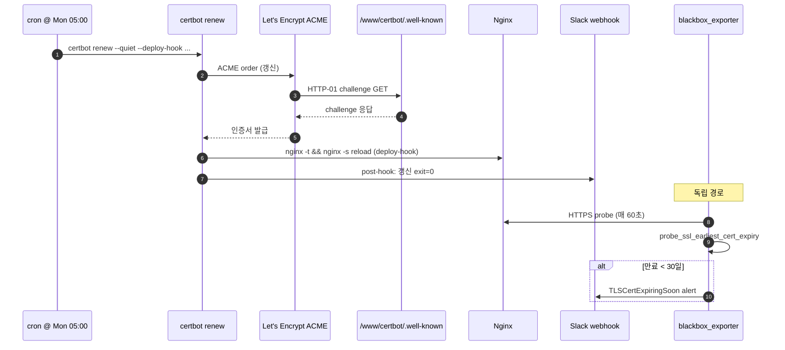

# [OPS-GUIDE-002] TLS / 인증서 운영

| 항목 | 값 |
| --- | --- |
| 문서 ID | OPS-GUIDE-002 |
| 시리즈명 | Nginx Production Hardening |
| 시리즈 인덱스 | [OPS-GUIDE-001 Master Index](./2026-05-15-OPS-GUIDE-001-master-index.md) |
| 생성일 | 2026-05-15 |
| 최근 검토일 | 2026-05-15 |
| 소유자 | SRE |
| 상태 | Living document |
| 다루는 영역 | TLS 인증서 lifecycle, 만료 모니터링, HSTS preload, Let's Encrypt 계정 백업, 갱신 워크플로우 |

## 시리즈 내 위치

| 번호 | 문서 | 관계 |
| --- | --- | --- |
| OPS-GUIDE-001 | Master Index | 상위 인덱스 — 우선순위 매트릭스, 위협 모델, 시리즈 전반 정책 참조 |
| **OPS-GUIDE-002** | **TLS / 인증서 운영** *(이 문서)* | |
| OPS-GUIDE-003 | [애플리케이션 계층 방어](./2026-05-15-OPS-GUIDE-003-application-layer-defense.md) | 인접 — HSTS preload 가 CSP enforcement (§8 도입) 와 함께 결정될 수 있음 |
| OPS-GUIDE-004 | [컨테이너 / 이미지 보안](./2026-05-15-OPS-GUIDE-004-container-and-image-security.md) | 인접 — secrets 관리 (TLS 키 보관) 가 본 가이드의 §1.6 과 연결 |
| OPS-GUIDE-005 | [운영 가시성](./2026-05-15-OPS-GUIDE-005-observability-and-operations.md) | 인접 — 본 가이드의 만료 모니터링 alert 가 §2 Observability 스택 위에 구축됨 |
| OPS-GUIDE-006 | [엣지 / 네트워크](./2026-05-15-OPS-GUIDE-006-edge-and-network.md) | 인접 — TLS handshake 거부 (`ssl_reject_handshake`) 가 §3 SSL mount 와 연결 |

---

## 1. TLS 인증서 lifecycle 및 만료 모니터링

**Severity: Critical | Effort: S**

### 1.1 근거 (Why)

Let's Encrypt 인증서는 90일 만에 만료됩니다. 갱신 cron 은 주간(`0 5 * * 1`)이며 `certbot renew` 는 만료 30일 전부터 갱신을 시도하므로 단일 주의 실패는 치명적이지 않지만 4주 연속 실패는 운영 중단입니다. 독립적인 모니터링 경로가 없으면 팀은 `NET::ERR_CERT_DATE_INVALID` 를 보고하는 사용자로부터 만료를 알게 됩니다.

인증서 갱신은 다음과 같은 비자명한 이유로 실패할 수 있습니다:

- ACME HTTP-01 challenge 경로 `/.well-known/acme-challenge/` 가 ngxblocker 에 의해 차단된 경우 (드뭄 — globalblacklist.conf 는 Let's Encrypt 의 UA 를 매칭하지 않지만, 커스텀 blacklist 추가가 이를 유발할 수 있음).
- webroot 경로 `/www/certbot` 이 unmount 되거나 무관한 PR 로 권한이 변경된 경우.
- Let's Encrypt rate limit 도달 (예: 등록된 도메인당 주당 50개 인증서 — 자동화로 서브도메인이 추가되는 fleet 에서 관련).
- 상위 DNS 문제 (rdns / NS 서버가 컨테이너 resolver 에서 접근 불가).
- 번들된 `certbot` 패키지가 처리하지 못하는 ACMEv2 프로토콜 변경.

### 1.2 현재 상태

`docker/nginx/Dockerfile` 에 다음 cron 라인이 빌드 시 등록됨:

```
0 5 * * 1 certbot renew --quiet --deploy-hook "nginx -t && nginx -s reload" \
  >> /log/nginx/crontab_$(date +%Y%m%d).log 2>&1
```

`--deploy-hook` 은 갱신 성공 시 nginx 를 graceful reload 합니다. 갱신 실패 시 알림은 없습니다. 외부 모니터도 없습니다.

### 1.3 구현 (Implementation)

갱신 control plane 은 **두 개의 독립 경로** 를 가져야 합니다 — 갱신 그 자체 (기존 주간 cron), 그리고 certbot 동작 여부와 무관하게 만료를 감지하는 외부 만료 모니터.

#### 경로 A — 갱신 hook 에 실패 알림 추가

`docker/nginx/Dockerfile` 의 cron 라인을 수정하여 갱신 결과와 무관하게 항상 실행되는 `--post-hook` 을 추가, certbot 종료 코드를 알림 webhook 으로 전송:

```dockerfile
RUN crontab -l 2>/dev/null | { cat; echo "0 5 * * 1 certbot renew --quiet \\
    --deploy-hook 'nginx -t && nginx -s reload' \\
    --post-hook 'echo \"certbot renew completed on \$(hostname) exit=\$?\" | \\
        curl -s -X POST -H Content-Type:application/json \\
        -d @- https://hooks.slack.com/services/...' \\
    >> /log/nginx/crontab_\$(date +\\%Y\\%m\\%d).log 2>&1"; } | crontab -
```

운영 환경에서는 Slack webhook URL 을 docker secret 또는 런타임 주입 환경변수에 저장하고, 절대 이미지에 bake 하지 마세요.

#### 경로 B — 독립 만료 모니터

이 경로가 두 개 중 더 중요합니다. 경로 A 는 certbot 이 실행될 때만 동작하기 때문입니다. 두 가지 구현:

**(1) Prometheus blackbox_exporter** + SSL probe 모듈:

```yaml
# blackbox.yml
modules:
  https_with_cert:
    prober: http
    timeout: 5s
    http:
      method: GET
      tls_config:
        insecure_skip_verify: false
```

prometheus.yml 에 각 공개 도메인을 target 으로 추가하는 scrape config 를 작성. `probe_ssl_earliest_cert_expiry` 메트릭이 만료 시각을 Unix timestamp 로 노출. Alertmanager 룰:

```yaml
- alert: TLSCertExpiringSoon
  expr: probe_ssl_earliest_cert_expiry - time() < 30 * 86400
  for: 1h
  labels: { severity: warning }
  annotations:
    summary: "{{ $labels.instance }} 의 TLS 인증서가 30일 이내 만료"
```

**(2) Prometheus 가 없는 환경 — 일일 cron + ssl-cert-check**. 호스트 crontab 에 추가:

```bash
0 9 * * * /usr/local/bin/ssl-cert-check -s example.com -p 443 -x 30 \
  -q -e ops@example.com
```

`ssl-cert-check` 는 표준 패키지 (대부분 Debian/Ubuntu repo 에 포함). `-x 30` 옵션은 30일 미만 남았을 때 이메일 발송.

### 1.4 검증 (Testing)

알림 경로를 **60일 기다리지 않고** 검증하려면, 임계치를 일시적으로 매우 높은 값 (예: `< 365 * 86400`) 으로 설정하여 즉시 발사하게 만들고, on-call 채널 수신 확인 후 원복.

갱신 hook 자체 검증은 스테이징 환경에서 강제 갱신 수행:

```bash
docker exec nginx-gunicorn-webserver certbot renew --force-renewal --dry-run
```

`--dry-run` 은 Let's Encrypt rate limit 을 소비하지 않으면서 post-hook 포함 전체 코드 경로를 실행합니다.

### 1.5 모니터링 (Monitoring)

도메인별 SSL probe 외에 다음을 추적:

- **`probe_success`** — HTTPS 엔드포인트에서 지속적으로 0 이면 인증서 파손, chain 문제, 또는 OCSP stapling 실패.
- **nginx error log 의 `OCSP_response_status` 또는 `SSL_do_handshake` 발생** — 강제 만료에 앞서는 cipher 또는 stapling 문제의 조기 신호.
- **certbot 자체 log** — `/var/log/letsencrypt/letsencrypt.log` (컨테이너 내부) 를 filebeat/promtail 로 색인.

### 1.6 흔히 빠지는 함정 (Common pitfalls)

- **Hook 은 실행되었지만 reload 가 새 인증서를 받지 못한다.** `--deploy-hook` 은 갱신 성공 후에만 실행됩니다. 갱신은 성공했지만 deploy-hook 명령이 실패 (예: 무관한 config 변경 때문에 `nginx -t` 거부) 하면 새 인증서는 디스크에 있지만 nginx 는 여전히 옛 것을 서빙합니다. 완화: hook 안에 `nginx -t` 를 포함하여 실패를 즉시 잡고, post-hook 에서 "갱신 성공 + reload 실패" 패턴을 별도 alert 클래스로 감지.
- **OCSP stapling 이 조용히 깨진다.** 상위 OCSP responder 에 도달 불가하면 `ssl_stapling_verify on` 으로 인해 nginx 가 OCSP 응답을 폐기하지만 TLS handshake 는 여전히 성공 (단지 느려짐). OCSP-must-staple 을 enforce 하는 클라이언트는 실패합니다. `openssl s_client -connect example.com:443 -status -servername example.com` 으로 테스트, `OCSP Response Status: successful` 확인.
- **DNS-01 vs HTTP-01.** wildcard 인증서는 DNS-01 challenge 필수. 현재 설정은 HTTP-01 만 사용, 이는 `server_name` 의 정확한 hostname 에서만 동작합니다. wildcard 가 필요하면 `certbot-dns-cloudflare` (또는 provider 별 플러그인) 설치 후 cron 명령 교체 — 비자명한 작업이며 API 자격증명 필요.

### 1.7 롤백 (Rollback)

알림 hook 추가 자체의 롤백은 단순합니다 — Dockerfile 의 cron 라인을 원복하고 이미지 재빌드. 갱신 자체가 망가진 경우 가장 빠른 복구는 `/etc/letsencrypt/live/<domain>/` 의 이전 인증서를 백업에서 복원하고 nginx 를 reload, 그 사이 ACME 문제를 디버그.

---

## 2. HSTS preload 등록

**Severity: Medium | Effort: XS (결정) + 비가역**

### 2.1 근거

현재 HSTS 헤더에는 `preload` 가 포함되어 있지만 https://hstspreload.org 에서 도메인이 등록되기 전까지는 효과가 없습니다. preload 목록에 들어가면 모든 Chrome/Firefox/Safari 사용자가 HTTPS 를 먼저 시도하므로 도메인에 대한 SSL-stripping MITM 공격이 완전히 사라집니다 — 사이트를 처음 방문하는 사용자에게도 적용.

### 2.2 등록 전 체크리스트 (모두 true 여야 함)

- [ ] HTTPS 가 `example.com` AND `www.example.com` AND 모든 서브도메인에서 서빙되는가?
- [ ] 모든 HTTP 요청이 HTTPS 로 리다이렉트 (301) 되는가?
- [ ] HSTS 헤더의 `max-age` ≥ 31536000 (1년, 최소 요건) 인가?
- [ ] HSTS 헤더에 `includeSubDomains` AND `preload` 가 포함되어 있는가?
- [ ] 도메인 소유자가 HTTPS 운영을 향후 무기한 유지할 것을 확인했는가? preload 목록에서 제거는 3~12개월 전파 시간이 필요.

### 2.3 등록 절차

https://hstspreload.org 방문 → 도메인 입력 → "Submit" 클릭. 등록된 도메인 이메일로 확인. 다음 브라우저 release cycle (6~12주) 에 포함.

### 2.4 검증

등록 신청 후:

```bash
# Chromium 계열 브라우저
chrome://net-internals/#hsts
# 도메인 입력 후 "Query HSTS/PKP domain" — found 표시되어야 함
```

또는 curl 로 직접:

```bash
curl -sI https://hstspreload.org/api/v2/status?domain=example.com
```

### 2.5 모니터링

등록 후에는 거의 모니터링이 필요 없습니다 (preload 는 클라이언트 측 정책). 단 다음 시나리오는 주의:

- **서브도메인 신규 추가 시**: HTTPS 미지원 서브도메인을 추가하면 preload 가 자동으로 그 서브도메인에도 적용되어 사용자가 접근 불가. 신규 서브도메인 deploy 워크플로우에 HTTPS 사전 검증 게이트 필수.
- **인증서 발급 일시 실패 시**: 일반 도메인이라면 사용자는 인증서 경고를 클릭해 우회 가능, 하지만 preload 등록된 도메인은 브라우저가 우회를 허용하지 않음. 만료 모니터링 (§1) 우선순위가 더 높아짐.

### 2.6 흔히 빠지는 함정

- **HTTP 미지원 서브도메인.** 개발 서브도메인 `dev.example.com` 이 HTTP 로 동작 중인 경우, 부모 도메인의 preload 가 강제로 HTTPS 업그레이드시키고 서브도메인이 로드 실패합니다. 등록 전 모든 서브도메인 감사.
- **제거가 어렵다.** 조직이 HTTPS 를 포기하거나 도메인을 양도하기로 결정하면, 제거 요청 제출 → 브라우저 release 대기 → 그래도 옛 브라우저 사용자들은 수년간 HSTS 를 enforce 함.

### 2.7 롤백

비가역. 등록 후에는 §2.6 의 제거 절차만 존재.

---

## 3. TLS 운영 워크플로우

### 3.1 TLS 인증서 갱신 + 실패 알림 에스컬레이션



**커버되는 실패 모드.** Slack webhook 이 잘못 구성되어 경로 A 가 실패해도 blackbox 모니터의 경로 B 가 임박한 만료를 감지. certbot 이 수 주간 조용히 깨져 있어도 모니터가 만료가 다가오는 것을 인지.

---

## 4. Let's Encrypt 계정 키 백업 (§4.15.3)

**Severity: Medium | Effort: XS**

### 4.1 근거

`/etc/letsencrypt/accounts/` 디렉터리에는 ACME 계정 키가 저장됩니다. 이 키는 대체 불가능 — 분실 시 운영자는 새 계정과 새 키를 등록해야 하며, 폐기(revocation) 기록 이력이 split 됩니다. 또한 같은 도메인에 대한 신규 계정 발급이 Let's Encrypt rate limit 의 영향을 받을 수 있습니다.

### 4.2 구현

호스트 측에서 일일 백업 cron 등록:

```bash
# /etc/cron.daily/letsencrypt-account-backup
#!/bin/bash
set -euo pipefail
SRC=/var/lib/docker/volumes/letsencrypt/_data/accounts  # 또는 bind mount 경로
DEST=s3://example-ops-backups/letsencrypt/$(hostname)/$(date +\%Y\%m\%d)
tar -czf - "$SRC" | aws s3 cp - "$DEST/accounts.tar.gz"
```

S3 가 아닌 환경에서는 rsync 로 별도 백업 서버에 송신.

### 4.3 검증

- 백업 디렉터리에 매일 신규 파일이 생기는지 확인.
- 분기마다 1회, 백업에서 복원 → 새 컨테이너에 마운트 → `certbot certificates` 실행 → 등록된 계정이 정상 인식되는지 확인.

### 4.4 모니터링

백업 cron 의 종료 코드를 monitoring 채널에 전송. AWS S3 라면 `aws s3 ls` 의 마지막 객체 mtime 으로 24시간 내 백업 부재 alert.

### 4.5 흔히 빠지는 함정

- **권한.** 계정 키 파일은 600 권한이며 백업 도구가 root 가 아니면 읽지 못합니다. 백업 cron 은 root 또는 ACL 명시.
- **암호화.** 계정 키는 매우 민중요 자산이므로 백업 시 client-side 암호화 필수. AWS S3 의 SSE 만으로는 부족.

### 4.6 롤백

복원: 백업 tarball 을 컨테이너 마운트 경로에 풀어넣고 `certbot certificates` 로 인식 확인.

---

## 5. References

- **Let's Encrypt 문서** — https://letsencrypt.org/docs/
- **Let's Encrypt rate limits** — https://letsencrypt.org/docs/rate-limits/
- **HSTS preload 등록** — https://hstspreload.org/
- **Mozilla SSL Configuration Generator** — https://ssl-config.mozilla.org/
- **blackbox_exporter** — https://github.com/prometheus/blackbox_exporter
- **ssl-cert-check** — https://github.com/Matty9191/ssl-cert-check

---

## 6. Change Log

| 날짜 | 작성자 | 변경 |
| --- | --- | --- |
| 2026-05-15 | 초기 작성 | OPS-GUIDE-001 마스터에서 분기. TLS lifecycle, HSTS preload, LE 계정 백업, 갱신 워크플로우 다이어그램 포함. |
