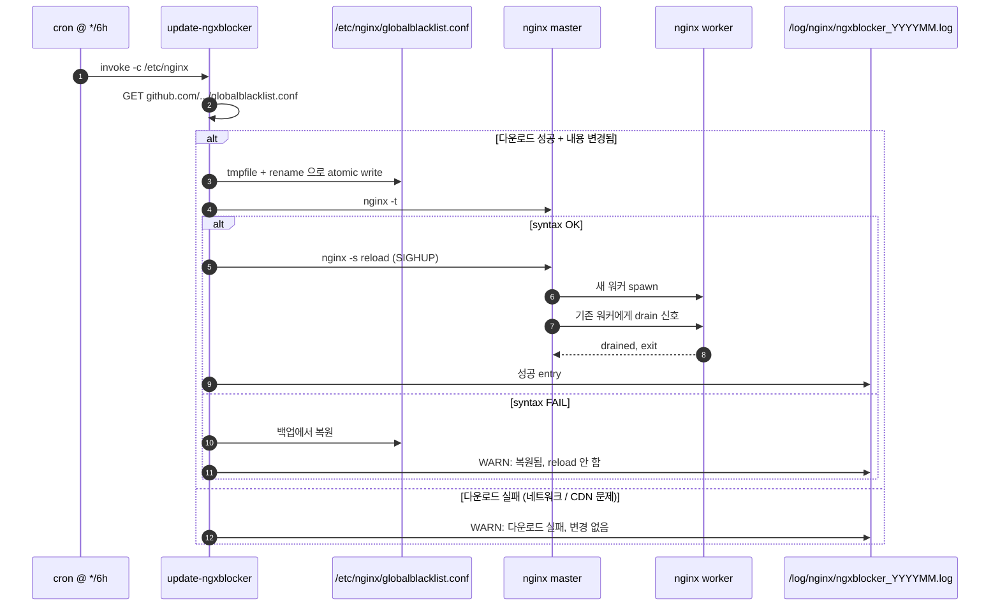
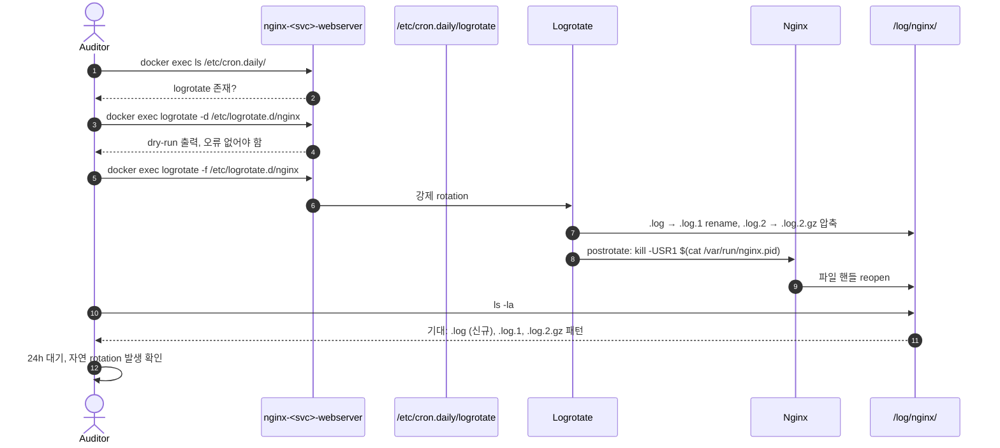

# [OPS-GUIDE-005] 운영 가시성 / 로그 / 메트릭

| 항목 | 값 |
| --- | --- |
| 문서 ID | OPS-GUIDE-005 |
| 시리즈명 | Nginx Production Hardening |
| 시리즈 인덱스 | [OPS-GUIDE-001 Master Index](./2026-05-15-OPS-GUIDE-001-master-index.md) |
| 생성일 | 2026-05-15 |
| 최근 검토일 | 2026-05-15 |
| 소유자 | SRE / Observability |
| 상태 | Living document |
| 다루는 영역 | 로그 회전, Observability 스택 (메트릭/로그/트레이스), 커스텀 에러 페이지, 감사 로그 immutability, secrets 관리, 백업/DR, 핵심 운영 워크플로우 |

## 시리즈 내 위치

| 번호 | 문서 | 관계 |
| --- | --- | --- |
| OPS-GUIDE-001 | Master Index | 상위 인덱스 |
| OPS-GUIDE-002 | [TLS / 인증서 운영](./2026-05-15-OPS-GUIDE-002-tls-certificate-lifecycle.md) | 의존자 — TLS 만료 alert 가 본 가이드 §2 Observability 스택 위에 구축 |
| OPS-GUIDE-003 | [애플리케이션 계층 방어](./2026-05-15-OPS-GUIDE-003-application-layer-defense.md) | 의존자 — WAF 감사 로그 / fail2ban 메트릭이 본 가이드의 스택을 사용 |
| OPS-GUIDE-004 | [컨테이너 / 이미지 보안](./2026-05-15-OPS-GUIDE-004-container-and-image-security.md) | 인접 |
| **OPS-GUIDE-005** | **운영 가시성 / 로그 / 메트릭** *(이 문서)* | |
| OPS-GUIDE-006 | [엣지 / 네트워크](./2026-05-15-OPS-GUIDE-006-edge-and-network.md) | 인접 — DDoS playbook 이 본 가이드의 alert 위에 동작 |

---

## 1. 로그 회전(logrotate) 작동 검증 및 강화

**Severity: Critical | Effort: S**

### 1.1 근거

Linux + docker 환경 mid-sized fleet 에서 관측된 가장 흔한 단일 nginx 운영 사고 원인은 `[emerg] open() failed (28: No space left on device)` 입니다. 로그는 트래픽에 선형 비례로 증가합니다 — 100 RPS 하에 모니터링 안 된 access_log 는 도메인당 일일 1~3 GB (log_format 너비에 따름). 본 compose 스택은 `/log` 를 host bind volume 으로 마운트하므로, 폭주하는 로그가 호스트 root filesystem 을 채워 nginx 만이 아니라 같이 배치된 **모든** 컨테이너를 다운시킵니다.

### 1.2 현재 상태

`devspoon-web/docker/nginx/Dockerfile` 과 3개 `devspoon-startup-*/docker/nginx/Dockerfile` 모두 `logrotate` 와 `cron` 패키지를 설치하고, docker-entrypoint.sh 가 `cron` 데몬을 시작하도록 patch 되어 있습니다. 호스트 디렉터리 `script/logrotate/nginx/nginx` 가 컨테이너의 `/etc/logrotate.d/nginx` 로 bind-mount. 그러나 **trigger 경로** — Debian 의 `/etc/cron.daily/logrotate` 가 매일 한 번 호출되는 것 — 이 실제로 컨테이너 내에서 발사되는지 검증되지 않았습니다. 기본 Debian cron 패키지가 cron.daily 스크립트를 실행하긴 합니다 (anacron 이 아니라 cron 자체가) — 따라서 이론상 동작하지만 감사 미수행.

### 1.3 구현 및 검증

#### 1.3.1 기존 trigger 감사 (실행 중 컨테이너에서)

```bash
docker exec nginx-gunicorn-webserver bash -c '
  ls -la /etc/cron.daily/logrotate &&
  cat /etc/cron.daily/logrotate &&
  ls -la /etc/logrotate.d/nginx &&
  cat /etc/logrotate.d/nginx &&
  pgrep -a cron
'
```

기대: cron.daily/logrotate 스크립트 존재 (Debian 패키지 post-install 이 생성), logrotate.d/nginx config 가 `/log/nginx/*.log` 를 참조, cron 데몬 동작.

#### 1.3.2 cron.daily 실제 동작 검증

rotation dry-run 으로 검증:

```bash
docker exec nginx-gunicorn-webserver logrotate -d /etc/logrotate.d/nginx 2>&1 | head -40
```

`-d` (debug) 는 아무것도 수정하지 않고 무엇이 일어날지 표시. 설정이 잘못되면 문제가 여기서 출력.

#### 1.3.3 비운영 컨테이너에서 실제 rotation 강제 후 점검

```bash
docker exec nginx-gunicorn-webserver logrotate -f /etc/logrotate.d/nginx
docker exec nginx-gunicorn-webserver ls -la /log/nginx/ | head -30
```

강제 rotation 후 기대 파일 패턴: `access.log`, `access.log.1`, `access.log.2.gz` (또는 압축 방식에 따라 `.zst`).

#### 1.3.4 Reload-without-restart 동작 검증

nginx 는 rotation 후 SIGUSR1 (또는 `nginx -s reopen`) 을 받아야 — 그렇지 않으면 rotated inode 에 계속 쓰고 새 `access.log` 가 비어있게 됩니다. 표준 logrotate.d/nginx recipe 는 `postrotate ... endscript` 로 처리. snippet 에 다음 포함 확인:

```
postrotate
    [ -f /var/run/nginx.pid ] && kill -USR1 $(cat /var/run/nginx.pid)
endscript
```

#### 1.3.5 24시간 대기 후 자연 발생 검증

새 dated `.log.1` / `.log.2.gz` 파일이 자동으로 나타나는지 확인.

### 1.4 모니터링

`/log/nginx/main_access.log` 의 inode age 와 크기에 대한 일일 Prometheus alert (또는 cron 기반 shell check + slack hook):

```promql
# main_access.log 가 >36시간 동안 rotate 되지 않았을 때 alert
time() - node_filesystem_files{mountpoint="/log/nginx"} > 129600
```

더 단순한 체크는 일일 스크립트:

```bash
find /log/nginx -name "*.log" -mtime -1 -size +5G \
  -exec echo "FATAL: {} 이 5GB 를 넘었고 rotate 안 됨" \;
```

### 1.5 흔히 빠지는 함정

- **anacron vs cron 분기.** base image 를 minimal 한 것 (예: `nginx:alpine`) 으로 전환하면 `cron.daily` 가 자동 trigger 되지 않으며 `cronie-anacron` (Alpine 미제공) 설치 또는 systemd timer / foreground rotation runner 로 마이그레이션 필요.
- **PID 파일 경로 mismatch.** nginx PID 파일이 `/run/nginx.pid` 에 있는데 postrotate 스크립트가 `/var/run/nginx.pid` 를 읽으면 (또는 그 반대) USR1 신호가 전달되지 않아 새 로그 파일이 비어있는 채로 옛 파일이 다른 이름으로 계속 증가. 현대 Debian 에서는 두 경로가 같은 파일을 가리키지만 커스텀 빌드는 다를 수 있음.
- **Bind-mount 소유권.** 호스트의 `/log/nginx` 가 in-container nginx 사용자가 새 파일에 쓸 수 없는 UID 소유라면 rotation 후 새 파일이 생성된 뒤 nginx 가 조용히 logging 중단. 호스트 디렉터리를 Debian `www-data` 의 UID/GID 33 으로 pin.

### 1.6 롤백

- 잘못된 logrotate 설정으로 인한 문제: `script/logrotate/nginx/nginx` 를 이전 버전으로 되돌리고 reload — bind mount 라 컨테이너 재시작 불필요.

---

## 2. Observability — 메트릭 / 로그 / 트레이스

**Severity: High | Effort: M**

### 2.1 근거

"측정하지 못하는 것은 관리할 수 없다" 가 nginx 에 가장 강하게 적용됩니다 — nginx 는 인터넷과 애플리케이션의 경계이기 때문. 모든 관측 가능한 실패 (404 spike, 5xx cluster, latency tail 증가, 인증서 만료, ddos) 는 메트릭 또는 로그 시그니처를 가집니다 — 문제는 누가 보고 있느냐.

### 2.2 현재 상태

stub_status 엔드포인트 미구성. nginx_exporter 미설치. 로그는 호스트의 `/log/nginx/` 에 저장되지만 중앙 수집 미구성.

### 2.3 구현 — 세 기둥

#### 2.3.1 메트릭

`nginx-vts-module` (Virtual Host Traffic Status) 설치 또는 `nginx_exporter` 사용. nginx_exporter 가 더 단순 — `/stub_status` 에서 읽음. nginx.conf 에 활성화:

```nginx
server {
    listen 127.0.0.1:8080;  # localhost-only
    location /stub_status {
        stub_status;
        access_log off;
        allow 127.0.0.1;
        deny all;
    }
}
```

`nginx-prometheus-exporter` 를 sidecar 로 실행, `127.0.0.1:8080/stub_status` 를 가리킴. 노출 메트릭: `nginx_connections_active`, `nginx_connections_reading`, `nginx_connections_waiting`, `nginx_http_requests_total`.

도메인별, 상태 코드별, location 별 메트릭은 `vts-module` — JSON 과 더 풍부한 Prometheus 엔드포인트 노출.

#### 2.3.2 로그

`/log/nginx/*_access.log` 와 `/log/nginx/*_error.log` 를 중앙 저장소로 ship:

- **Loki + Promtail** — 가장 저렴, TB/일 까지 확장. 로그는 색인되지 않으며 LogQL 쿼리가 스캔.
- **Elasticsearch + Filebeat** — 완전 색인, 빠른 쿼리, 대규모에서 비싸짐.
- **CloudWatch / Stackdriver / Azure Monitor** — managed 동등물.

현재 `log_format main` 이 이미 `$remote_addr`, `$status`, `$body_bytes_sent`, `$request_time`, `$upstream_response_time` 을 포함 — 로그 기반 메트릭 (RED 방법: rate, errors, duration) 산출에 충분.

#### 2.3.3 트레이스

OpenTelemetry. nginx 자체에는 덜 중요 (빠르므로), nginx → 백엔드 → 데이터베이스 span 상관에 더 중요. `opentelemetry-nginx` 모듈 설치 후 `proxy_set_header traceparent $http_traceparent;` 로 upstream 에 전파.

### 2.4 대시보드와 alert — 최소 viable

starter Grafana 대시보드에 포함:

| 패널 | 쿼리 | Alert |
| --- | --- | --- |
| 도메인별 request rate | `sum by (host) (rate(nginx_http_requests_total[5m]))` | 7d 추세 대비 50% 이상 drop |
| 5xx rate | `sum(rate({status=~"5.."}[5m])) / sum(rate({status!=""}[5m]))` | 5분간 >1% |
| 444 rate (봇 차단) | `sum(rate({status="444"}[5m]))` | 갑작스러운 10배 증가 |
| p99 latency | `histogram_quantile(0.99, rate(nginx_http_request_duration_seconds_bucket[5m]))` | 10분간 >2s |
| Upstream timeout | `rate(nginx_upstream_response_time_seconds_count{le="+Inf"}[5m])` | 5분간 >0.1/s |
| TLS cert 만료 | `probe_ssl_earliest_cert_expiry - time()` | <30일 |
| OOM events | `container_oom_events_total{name=~"nginx-.*"}` | 모두 |
| ngxblocker map 크기 | `nginx -V \| strings` 의 텍스트 패널 | 주간 수동 review |

### 2.5 흔히 빠지는 함정

- **SLO 부재.** 명시적 SLO ("월간 측정으로 99.95% 요청이 500ms 미만") 없이는 alert 임계가 임의. SLO 먼저 정의, 그 다음 burn rate 로 fire 하는 alert.
- **유지 정책 없는 로그.** 중앙 로그 저장소가 무한 증가. 30일 hot / 1년 cold tier 설정.
- **트레이스의 과도한 sampling.** Tail-based sampling (모든 error trace 유지 + 성공의 1% sample) 이 head-based 1% sampling 보다 훨씬 valuable.

### 2.6 롤백

- exporter 가 메트릭 noise 를 유발하면 sidecar 비활성화: compose 의 sidecar service 주석 처리 후 reload.
- log shipping 이 디스크 압박을 일으키면 Promtail/Filebeat container 일시 중지 — 로그는 호스트에 남아있으므로 유실 없음.

---

## 3. 커스텀 에러 페이지

**Severity: Low | Effort: XS**

### 3.1 근거

기본 nginx 에러 페이지는 `server_tokens off` 상태에서도 본문에 "nginx" 를 표시. 보안 exploit 은 아니지만 자동화된 정찰에 기술 스택을 노출. 더 중요한 건 장애 시 사용자 경험이 빈약함.

### 3.2 현재 상태

기본 nginx 에러 페이지 사용 중. 커스텀 페이지 미구성.

### 3.3 구현

`/etc/nginx/error_pages/404.html`, `/etc/nginx/error_pages/5xx.html` 등을 inline CSS 만 사용 (외부 의존성 없이 — 백엔드 다운 시에도 동작해야 함) 으로 작성.

nginx.conf 의 http 컨텍스트에:

```nginx
error_page 404 /custom_404.html;
error_page 500 502 503 504 /custom_5xx.html;
```

그리고 모든 server 블록에:

```nginx
location = /custom_404.html {
    root /etc/nginx/error_pages;
    internal;
}
location = /custom_5xx.html {
    root /etc/nginx/error_pages;
    internal;
}
```

HTML 파일을 `COPY` directive 로 Docker 이미지에 bake — 컨테이너와 함께 ship.

### 3.4 검증

```bash
curl -sI https://example.com/this-does-not-exist
# 기대: HTTP/1.1 404 Not Found, 커스텀 페이지 본문
```

응답에 "nginx" 문자열이 없는지 확인:

```bash
curl -s https://example.com/this-does-not-exist | grep -i nginx
# 기대: 매칭 없음
```

### 3.5 모니터링

- 변경된 에러 페이지 응답 코드 분포가 변하지 않는지 확인 (커스텀 페이지가 status code 자체는 보존해야 함).
- 5xx 페이지가 백엔드 장애 시 정상 노출되는지 chaos test.

### 3.6 흔히 빠지는 함정

- **에러 페이지 내 외부 asset.** 5xx 페이지가 `<link href="/static/error.css">` 를 참조하면 그 자체가 백엔드 다운 시 실패. 모든 CSS 인라인, `` 태그 회피.
- **Caching.** 일부 CDN 이 404 응답을 공격적으로 캐시. 5xx 페이지에 `Cache-Control: no-store` 설정으로 transient 장애가 sticky 가 되는 것 방지.

### 3.7 롤백

- nginx.conf 의 `error_page` directive 와 location 블록 주석 처리 후 reload. 60초 이내 기본 페이지로 복귀.

---

## 4. 운영 워크플로우

### 4.1 ngxblocker 자동 갱신 + 안전한 reload



**Observability hook.** 최근 24시간 동안 성공 entry 가 없으면 alert (4회 연속 실패). 백업-복원 이벤트 발생 시 alert (업스트림이 잘못된 syntax 를 push 했을 가능성 시사).

### 4.2 로그 회전 검증 1회성 감사



---

## 5. 감사 로그 immutability (§4.15.7)

**Severity: Medium ~ High (컴플라이언스 의존) | Effort: M**

### 5.1 근거

PCI-DSS 10.5, SOC2 CC7, ISO27001 A.12.4 등 컴플라이언스 레짐은 감사 로그가 변경 불가능해야 함을 요구. 침해 발생 시 공격자가 흔적을 지우지 못하도록 — 그리고 사고 조사에서 로그 무결성에 대한 신뢰를 얻기 위함.

### 5.2 구현

#### 5.2.1 AWS S3 Object Lock

```bash
# 버킷 생성 시 Object Lock 활성화
aws s3api create-bucket --bucket ops-audit-logs --object-lock-enabled-for-bucket

# Compliance 모드 + 7년 retention
aws s3api put-object-lock-configuration --bucket ops-audit-logs \
  --object-lock-configuration '{
    "ObjectLockEnabled": "Enabled",
    "Rule": { "DefaultRetention": { "Mode": "COMPLIANCE", "Years": 7 } }
  }'
```

Promtail/Filebeat 가 로그를 S3 로 ship. 한 번 쓰여진 객체는 root 도 삭제 불가 (Compliance 모드).

#### 5.2.2 GCS retention policy

```bash
gsutil retention set 7y gs://ops-audit-logs
gsutil retention lock gs://ops-audit-logs
```

#### 5.2.3 On-prem WORM (Write-Once Read-Many) 스토리지

- 별도 호스트 + read-only NFS mount + 일별 snapshot.
- 또는 hardware WORM 어플라이언스 (NetApp SnapLock, Dell Isilon SmartLock 등).

### 5.3 검증

```bash
# 객체를 삭제하려고 시도 — 거부되어야 함
aws s3 rm s3://ops-audit-logs/2026-05-15/access.log.gz
# 기대: "AccessDenied: ... object lock retention period ..."
```

분기마다 1회, root 권한으로도 삭제가 불가함을 검증.

### 5.4 모니터링

- S3 Object Lock 정책이 활성 상태로 유지되는지 일일 검증 (CloudTrail event).
- ship 실패 시 alert — 로그가 실제로 immutable storage 에 도달하지 못하면 무의미.

### 5.5 흔히 빠지는 함정

- **Governance vs Compliance 모드.** S3 Object Lock 의 Governance 모드는 root 가 우회 가능 — 컴플라이언스 요구에 부적합. 반드시 Compliance 모드.
- **Retention 기간 너무 짧음.** PCI-DSS 는 1년, SOC2 는 보통 7년. 적용 가능한 규정의 최대치로 설정.
- **로그 ship 지연.** 컨테이너에서 immutable storage 까지의 갭이 클수록 공격자가 흔적을 지울 창이 큼. <5분 지연 권장.

### 5.6 롤백

비가역. Compliance 모드 Object Lock 은 retention 기간 이전에 비활성화 불가. 이는 컴플라이언스 요구의 핵심이며 design 의도.

---

## 6. Secrets 관리 (§4.15.8)

**Severity: Medium ~ High | Effort: M**

### 6.1 근거

현재 SSL 키는 `/etc/letsencrypt/live/<domain>/privkey.pem` 에 600 권한으로 디스크 저장. 더 높은 보안 환경에서는 HashiCorp Vault 또는 AWS Secrets Manager 와 통합하여 init container 로 주입.

### 6.2 구현

#### 6.2.1 Vault 통합 (예시)

```yaml
services:
  vault-agent:
    image: hashicorp/vault:latest
    command: vault agent -config=/etc/vault-agent.hcl
    volumes:
      - vault-secrets:/secrets
  webserver:
    depends_on: [vault-agent]
    volumes:
      - vault-secrets:/etc/nginx/secrets:ro
```

Vault Agent 가 short-lived (예: 24h) 인증서를 fetch 하여 shared volume 에 둠. nginx 가 그것을 읽음.

#### 6.2.2 AWS Secrets Manager + ECS task role

ECS task role 이 Secrets Manager 에서 SSL key 를 GetSecretValue 권한으로 접근. container 가 boot 시 init script 로 secret 을 로컬 파일에 쓰고 nginx 가 그것을 읽음.

### 6.3 검증

- 컨테이너 외부 (호스트 filesystem) 에서 SSL key 가 발견되지 않는지 확인.
- Vault token revoke / Secrets Manager IAM policy 차단 시 새 인증서 fetch 실패 alert.

### 6.4 흔히 빠지는 함정

- **Bootstrap secret.** Vault 와 통신하기 위한 token 자체가 secret 이며 어딘가에 저장됨 — turtle all the way down. AWS IAM role 이나 SPIFFE/SPIRE 같은 workload identity 가 해결책.
- **Volume permission.** shared volume 의 권한을 잘못 설정하면 다른 컨테이너가 secret 을 읽음.

### 6.5 롤백

- Vault Agent / Secrets Manager 통합 비활성화: compose 에서 sidecar 제거, 기존 디스크 저장 방식으로 복귀.

---

## 7. 백업 / DR (§4.15.9)

**Severity: High | Effort: M**

### 7.1 근거

월간 테스트된 복원이 `/etc/letsencrypt`, `/log/nginx`, docker-compose state 의 최소. "0 부터 nginx fleet 재구축" RTO 를 문서화 — 모든 것이 git 에 있고 이미지가 immutable 하게 tagged 되어 있으면 일반적으로 1시간 미만.

### 7.2 구현

#### 7.2.1 백업 대상

| 대상 | 백업 빈도 | retention | 도구 |
| --- | --- | --- | --- |
| `/etc/letsencrypt/` | 일일 | 30일 | rsync / restic / S3 |
| `/log/nginx/` | rotate 즉시 ship | 위 §5 immutability 적용 | promtail / filebeat |
| docker-compose state | git push 시 | 영구 | git |
| 이미지 | tag push 시 | 분기당 1개 + LTS | docker registry |
| Redis 데이터 | 시간별 (필요 시) | 7일 | redis-cli BGSAVE + rsync |

#### 7.2.2 DR 시나리오 별 RTO/RPO

| 시나리오 | RTO | RPO | 절차 |
| --- | --- | --- | --- |
| 단일 컨테이너 crash | 1분 | 0 | `docker compose restart` |
| 호스트 디스크 손실 | 30분 | 1시간 (rsync 주기) | 백업에서 letsencrypt 복원 + git clone + docker compose up |
| 데이터센터 손실 | 2시간 | 1시간 | 대기 리전 활성화 (수동 DNS switch) |
| ngxblocker 업스트림 침해 | 6시간 | 0 (다운로드 안 함) | cron 비활성화, 마지막 known-good globalblacklist.conf 사용 |

### 7.3 검증

분기마다 1회 DR drill:

1. 스테이징 호스트의 docker / config / letsencrypt 디렉터리 전체 삭제.
2. 백업에서 복원 + git pull.
3. `docker compose up -d`.
4. verify-ngxblocker.sh 통과 확인.
5. 측정된 RTO 가 문서화된 RTO 내인지 확인.

### 7.4 흔히 빠지는 함정

- **백업이 같은 호스트에.** 호스트 손실 시 백업도 같이 손실. 반드시 off-host 또는 off-region.
- **복원 테스트 안 함.** 백업이 존재해도 실제로 복원 가능한지 검증 안 하면 DR 시 발견. 분기 drill 필수.
- **암호화 키 분실.** 백업이 암호화되어 있고 키가 백업과 같은 곳에 저장되어 있으면 사실상 백업 없음.

### 7.5 롤백

- 백업 자체에 롤백 개념 없음. DR 절차로 forward-fix.

---

## 8. References

- **logrotate(8)** — https://linux.die.net/man/8/logrotate
- **Prometheus** — https://prometheus.io/
- **Grafana** — https://grafana.com/
- **Loki / Promtail** — https://grafana.com/oss/loki/
- **OpenTelemetry** — https://opentelemetry.io/
- **nginx-prometheus-exporter** — https://github.com/nginxinc/nginx-prometheus-exporter
- **nginx-vts-module** — https://github.com/vozlt/nginx-module-vts
- **Google SRE Workbook (SLO 정의)** — https://sre.google/workbook/
- **AWS S3 Object Lock** — https://docs.aws.amazon.com/AmazonS3/latest/userguide/object-lock.html
- **HashiCorp Vault** — https://www.vaultproject.io/

---

## 9. Change Log

| 날짜 | 작성자 | 변경 |
| --- | --- | --- |
| 2026-05-15 | 초기 작성 | OPS-GUIDE-001 마스터에서 분기. 로그 회전, Observability 스택, 커스텀 에러 페이지, 감사 로그 immutability, secrets 관리, 백업/DR, 운영 워크플로우 다이어그램 (ngxblocker 갱신, 로그 회전 검증) 포함. |
