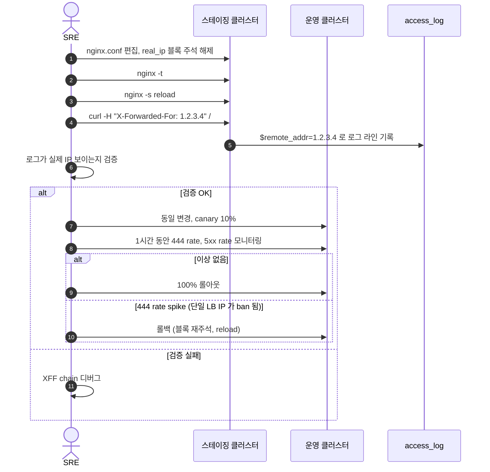

# [OPS-GUIDE-006] 엣지 / 네트워크

| 항목 | 값 |
| --- | --- |
| 문서 ID | OPS-GUIDE-006 |
| 시리즈명 | Nginx Production Hardening |
| 시리즈 인덱스 | [OPS-GUIDE-001 Master Index](./2026-05-15-OPS-GUIDE-001-master-index.md) |
| 생성일 | 2026-05-15 |
| 최근 검토일 | 2026-05-15 |
| 소유자 | 네트워크 / SRE |
| 상태 | Living document |
| 다루는 영역 | HTTP/3 (QUIC), real_ip 활성화, SSL mount 범위 정리, Slowloris/Slow POST 강화, HTTP/2 CONTINUATION flood (CVE-2024-27316), DDoS 에스컬레이션 playbook, 운영 워크플로우 |

## 시리즈 내 위치

| 번호 | 문서 | 관계 |
| --- | --- | --- |
| OPS-GUIDE-001 | Master Index | 상위 인덱스 |
| OPS-GUIDE-002 | [TLS / 인증서 운영](./2026-05-15-OPS-GUIDE-002-tls-certificate-lifecycle.md) | 인접 — TLS handshake 거부 (§3 SSL mount) 와 인증서 관리 연계 |
| OPS-GUIDE-003 | [애플리케이션 계층 방어](./2026-05-15-OPS-GUIDE-003-application-layer-defense.md) | **선행자** — §2 real_ip 활성화는 OPS-GUIDE-003 §2 fail2ban 도입의 필수 선행 조건 |
| OPS-GUIDE-004 | [컨테이너 / 이미지 보안](./2026-05-15-OPS-GUIDE-004-container-and-image-security.md) | 인접 — Egress 필터링 (OPS-GUIDE-004 §5) 이 §4 DDoS playbook 과 연계 |
| OPS-GUIDE-005 | [운영 가시성](./2026-05-15-OPS-GUIDE-005-observability-and-operations.md) | 의존 — DDoS playbook (§4) 이 Observability 스택의 alert 위에 동작 |
| **OPS-GUIDE-006** | **엣지 / 네트워크** *(이 문서)* | |

---

## 1. HTTP/3 (QUIC) 도입

**Severity: Low (성능) | Effort: M**

### 1.1 근거

QUIC 위의 HTTP/3 은 handshake latency 를 ~1 RTT (resume 세션의 경우 0-RTT) 로 줄이고, 네트워크 변경을 견뎌냅니다 (모바일 사용자가 WiFi → cellular 전환 시 연결 유지), TCP head-of-line blocking 을 회피. 모바일 집중 트래픽에서 실제로 사용자에게 보이는 개선.

### 1.2 현재 상태

`nginx:1.27-bookworm` 이미지에는 HTTP/3 가 기본 포함되지 않습니다 (바이너리가 `--with-http_v3_module` 없이 컴파일됨). HTTP/2 만 활성. UDP/443 미사용.

### 1.3 구현

두 가지 경로:

1. **`nginx:1.27` mainline 이미지로 전환** — HTTP/3 포함.
2. **커스텀 빌드**: `--with-http_v3_module --with-stream_quic_module`. 완전한 QUIC 지원을 위해 OpenSSL 대신 BoringSSL 사용, 또는 OpenSSL 3.x 의 QUIC 지원 추가 대기 (진행 중).

QUIC 활성 nginx 가 자리잡으면 각 `sample_nginx_https.conf` 갱신:

```nginx
listen 443 quic reuseport;
listen 443 ssl;
listen [::]:443 quic reuseport;
listen [::]:443 ssl;
http2 on;
http3 on;
add_header Alt-Svc 'h3=":443"; ma=86400' always;
```

방화벽에 UDP/443 개방.

### 1.4 검증

```bash
curl --http3 -sI https://example.com/
# 기대: HTTP/3 200
```

또는 https://http3check.net 사용.

브라우저에서 검증:
- Chrome DevTools → Network → Protocol 컬럼에서 `h3` 표시 확인.

### 1.5 모니터링

- **HTTP/3 vs HTTP/2 트래픽 비율** — 모바일 클라이언트가 실제로 upgrade 하는지 확인.
- **QUIC handshake failure rate** — UDP 차단된 네트워크의 클라이언트는 자동 fallback, 하지만 비율이 너무 높으면 문제.
- **0-RTT replay attack 시도** — QUIC 의 0-RTT 는 replay 공격에 취약하므로 nginx 가 0-RTT 요청을 별도 로그.

### 1.6 흔히 빠지는 함정

- **기업 방화벽이 UDP/443 차단.** 많은 enterprise 네트워크가 DNS 외 outbound UDP 를 차단. 브라우저는 HTTP/2 로 fallback — `Alt-Svc` 광고는 hint 일 뿐 요구사항이 아님.
- **Stateless LB 가 QUIC 를 깨뜨림.** Connection ID 인식 없는 L4 LB 는 QUIC connection migration 을 방해. Connection-ID 인식 LB 사용 (HAProxy 2.6+, nginx 자체).
- **0-RTT 의 보안 trade-off.** GET 요청만 0-RTT 허용 (idempotent), POST 는 거부. `ssl_early_data on;` 활성 시 애플리케이션 측 idempotency 보장 필요.

### 1.7 롤백

- `sample_nginx_https.conf` 의 `listen 443 quic` / `http3 on` 주석 처리 후 reload. HTTP/2 만 동작 상태로 복귀.
- 이미지 단계 롤백: HTTP/3 미포함 이전 이미지 tag 로 `docker compose up -d --force-recreate`.

---

## 2. real_ip 활성화

**Severity: Critical (LB 뒤 운영 시) | Effort: XS**

### 2.1 근거

이미 `nginx.conf` 의 인라인 가이드 주석에 자세히 다뤄져 있습니다. 단일 가장 중요한 포인트: **real_ip 없이는 ddos.conf 가 모든 클라이언트를 LB IP 하나에 묶음** — 단일 봇 매칭이 그 LB 를 통과하는 모든 정상 사용자를 차단하는 것을 의미. 실패 모드는 갑작스럽고, 사용자에게 보이며, 진단하기 혼란스러움.

### 2.2 현재 상태

비활성. nginx.conf 의 각 백엔드 (gunicorn/uwsgi/php) 에 활성화 가이드 주석 블록이 추가되어 있어 운영 환경 확인 후 한 블록만 주석 해제하면 됨.

### 2.3 활성화 요약

`nginx.conf` 의 세 예시 블록 (CloudFlare / AWS ALB / 사내 LB) 중 하나의 주석 해제. `set_real_ip_from` CIDR 을 실제 신뢰 가능한 proxy 범위로 갱신. Reload:

```bash
docker exec nginx-<svc>-webserver bash -c 'nginx -t && nginx -s reload'
```

#### 2.3.1 CloudFlare 예시

```nginx
set_real_ip_from 173.245.48.0/20;
set_real_ip_from 103.21.244.0/22;
# ... CloudFlare 공식 IP 전체 ...
real_ip_header CF-Connecting-IP;
real_ip_recursive off;  # 단일 IP 헤더라 recursive 불필요
```

#### 2.3.2 AWS ALB 예시

```nginx
set_real_ip_from 10.0.0.0/8;  # VPC 내부 대역만
real_ip_header X-Forwarded-For;
real_ip_recursive on;
```

#### 2.3.3 사내 reverse-proxy 예시

```nginx
set_real_ip_from 192.168.10.0/24;
real_ip_header X-Forwarded-For;
real_ip_recursive on;
```

### 2.4 검증

```bash
curl -H "X-Forwarded-For: 1.2.3.4" http://<your-domain>/
tail -1 /log/nginx/<your-domain>_access.log | awk '{print $1}'
# 기대: 1.2.3.4 (또는 XFF chain 해결 결과)
```

### 2.5 활성화 전 치명적 안전 점검

**절대 `set_real_ip_from 0.0.0.0/0;` 으로 설정하지 마세요** — 어떤 클라이언트든 `X-Forwarded-For: <임의 IP>` 를 보내 source IP 를 spoof 할 수 있게 됨. 신뢰 가능한 proxy 범위는 물리적으로 가능한 한 좁아야 함.

### 2.6 모니터링

- **`$remote_addr` 분포** — `awk '{print $1}' access.log | sort | uniq -c | sort -rn` 의 top entry 가 LB IP 라면 real_ip 가 동작하지 않거나 `set_real_ip_from` 범위가 잘못됨.
- **봇 차단율** — real_ip 활성화 후 봇 차단 카운터가 폭증 (이전엔 LB IP 하나로 통합됐던 게 실제 봇 IP 로 분리됨) — 정상.

### 2.7 흔히 빠지는 함정

- **`X-Forwarded-For` 와 `X-Real-IP` 혼동.** XFF 는 chain (`client, proxy1, proxy2`), Real-IP 는 단일 값. CloudFlare 의 `CF-Connecting-IP` 는 항상 단일 — recursive 불필요.
- **proxy chain 의 hop 수 mismatch.** LB 가 2단으로 있는데 `real_ip_recursive on` 안 켜면 마지막 hop 의 LB IP 가 client IP 로 기록됨.
- **신뢰 범위 변경.** LB IP 가 변경 (예: AWS 가 새 ALB 노드 추가) 시 `set_real_ip_from` 갱신 필요. CloudFlare 는 분기별 IP 목록 변경 — 자동 갱신 cron 또는 수동 갱신 일정 필요.

### 2.8 단계적 롤아웃 시퀀스 다이어그램

→ [§4.1 real_ip 활성화 단계적 롤아웃](#41-real_ip-활성화-단계적-롤아웃) 참조.

### 2.9 롤백

- nginx.conf 의 `set_real_ip_from` / `real_ip_header` 라인 주석 처리 후 reload. 즉시 비활성.

---

## 3. SSL mount 범위 정리

**Severity: Low | Effort: S**

### 3.1 근거

compose 파일이 호스트 디렉터리 `compose/web_service/nginx_<svc>/ssl/certs/` 를 컨테이너의 `/etc/ssl/certs/` 로 bind-mount, 컨테이너의 system CA 번들을 호스트 filesystem 에 그대로 교체. CA 번들은 공개 정보이므로 기밀 문제는 아니지만 의도되지 않은 효과: 호스트 디렉터리에 운영자가 두지 않은 ~200 CA 인증서가 결국 자리잡음. 미래의 contributor 가 이 파일들이 왜 존재하는지 이해 못 하고 삭제하면 컨테이너의 outbound TLS 가 깨짐.

또한 2026년 5월 review 에서 발견된 근본 원인: build 시점에 `/etc/ssl/certs/default/` 에 두려 했던 dummy 인증서가 bind mount 에 의해 덮어쓰여졌음. dummy 는 `/etc/nginx/ssl/default/` (bind-mount 대상 아님) 로 이동되어 해결.

### 3.2 현재 상태

`/etc/ssl/certs/` 가 호스트와 bind-mount 됨. system CA 번들이 호스트에 그대로 노출.

### 3.3 권장 정리

bind mount 를 실제로 호스트 측 관리가 필요한 디렉터리로만 좁힘:

```yaml
volumes:
  - ./ssl/dhparam:/etc/ssl/dhparam:ro
  - ./ssl/letsencrypt:/etc/letsencrypt
```

`./ssl/certs:/etc/ssl/certs` 제거 — 컨테이너 내장 CA 번들은 정확하며 Dockerfile 의 `update-ca-certificates` 로 자체 유지됨.

### 3.4 검증

mount 좁힌 후 컨테이너에서 outbound TLS 가 여전히 동작하는지 확인 (ngxblocker 업데이트와 certbot ACME 에 필요):

```bash
docker exec nginx-<svc>-webserver curl -sI https://raw.githubusercontent.com/
# 기대: HTTP/2 200 (또는 302), TLS handshake 성공
```

### 3.5 모니터링

- ngxblocker cron 의 6시간 갱신 성공률 — TLS outbound 가 깨지면 즉시 실패.
- certbot 주간 갱신 — 마찬가지.

### 3.6 흔히 빠지는 함정

- **호스트 디렉터리 잔존.** mount 제거 후 호스트의 `ssl/certs/` 디렉터리는 그대로 남음. 정리 작업의 일부로 호스트 디렉터리 삭제 또는 archive.
- **다른 서비스가 같은 mount 에 의존.** 본 디렉터리에 의존하는 다른 service 가 compose 안에 있을 수 있음. 변경 전 grep 으로 확인.

### 3.7 롤백

- compose 파일에 bind mount 라인 복원 후 `docker compose up -d --force-recreate`.

---

## 4. 운영 워크플로우

### 4.1 real_ip 활성화 단계적 롤아웃



---

## 5. Slowloris / Slow POST 강화 (§4.15.1)

**Severity: Medium | Effort: S**

### 5.1 근거

현재 `client_header_timeout=15s`, `client_body_timeout=15s`, `send_timeout=15s` 는 좋은 baseline. 추가로 IP 단위 동시 연결을 봇 상태와 무관하게 제한하는 것이 본격적인 Slowloris 방어.

### 5.2 구현

http 컨텍스트에 추가:

```nginx
limit_conn_zone $binary_remote_addr zone=slowconn:10m;
```

각 server 블록에:

```nginx
limit_conn slowconn 50;
```

이는 **봇만 차단하는 ddos.conf 와 별도** — 모든 IP 에 적용되는 hard limit. IP 당 50 동시 연결은 NAT 뒤의 큰 조직도 충분히 허용하는 너그러운 값이지만 단일 호스트의 slowloris 도구는 차단.

### 5.3 검증

```bash
# slowhttptest 설치
apt-get install -y slowhttptest

# Slowloris 모드 — 1000 연결을 천천히 유지
slowhttptest -c 1000 -H -i 10 -r 200 -t GET -u https://example.com -x 24 -p 3

# 기대: 50개 연결만 수락되고 나머지는 거부
```

### 5.4 모니터링

- **`limit_conn_zone` 사용률** — nginx 의 `$limit_conn_status` 변수를 log_format 에 추가해 거부 비율 추적.
- **active connection 수** — `nginx_connections_active` 가 갑자기 worker_connections 한계에 근접하면 Slowloris 의심.

### 5.5 흔히 빠지는 함정

- **너무 낮은 limit 으로 NAT 사용자 차단.** 50 은 일반적 NAT 환경에서 안전. 25 이하는 corporate NAT 와 대학 캠퍼스에서 false positive 발생.
- **HTTP/2 multiplexing.** HTTP/2 는 단일 connection 에 다중 stream — connection 단위 limit 은 효과가 약함. 추가로 `http2_max_concurrent_streams 128;` 같은 stream-level 제한 검토.

### 5.6 롤백

- `limit_conn slowconn` directive 주석 처리 후 reload.

---

## 6. HTTP/2 CONTINUATION flood (§4.15.2)

**Severity: Critical (취약 버전) → 현재 안전 | Effort: 검증만**

### 6.1 근거

CVE-2024-27316 — HTTP/2 의 CONTINUATION 프레임을 끝없이 보내 nginx 의 메모리를 고갈시키는 DoS. nginx 1.25.0+ 가 fix 포함. 본 환경은 nginx 1.27 이므로 이미 안전하지만 검증 필요.

### 6.2 검증

```bash
docker exec nginx-gunicorn-webserver nginx -V 2>&1 | grep '^nginx version'
# 기대: nginx version: nginx/1.27.x (1.25 이상)
```

추가로 nghttp2 같은 도구로 직접 flood 시뮬레이션 가능 (스테이징에서):

```bash
# 1000 CONTINUATION 프레임 전송 — 정상 nginx 는 RST_STREAM 으로 거부
nghttp -v -H ':method: GET' -H ':path: /' \
  -H "x-header-1: ..." -H "x-header-2: ..." [...반복...] \
  https://staging.example.com
```

### 6.3 모니터링

- nginx 버전을 image build pipeline 의 정기 audit 에 포함.
- CVE-2024-27316 가 nginx 1.27 의 한 patch level 에 fix 되었지만, 이후 다른 HTTP/2 CVE 발생 가능 — OPS-GUIDE-004 §3 이미지 스캐닝이 catch.

### 6.4 흔히 빠지는 함정

- **base image 다운그레이드.** 이전 nginx 버전으로 다운그레이드 시 CVE 재노출. 이미지 스캐닝 (OPS-GUIDE-004 §3) 으로 자동 감지.

### 6.5 롤백

해당 없음. 검증만.

---

## 7. DDoS 에스컬레이션 playbook (§4.15.10)

**Severity: High (사고 발생 시) | Effort: 분기 drill**

### 7.1 근거

ddos.conf 와 ngxblocker 가 포화 (CPU 100%, 정상 사용자가 503 받음) 되면, playbook 은:

### 7.2 에스컬레이션 단계

#### 단계 1 — 즉시 (수분 내)

상위 CDN DDoS 보호 활성화 (CloudFlare "Under Attack" 모드, AWS Shield Advanced 활성화 등). 트래픽의 80%+ 가 엣지에서 종료되어 nginx 부담 완화.

#### 단계 2 — 단기 (분 ~ 시간 단위)

`/log/nginx/*_access.log` 분석으로 dominant source IP 식별:

```bash
awk '{print $1}' /log/nginx/main_access.log | sort | uniq -c | sort -rn | head -20
```

상위 IP 를 `bots.d/blacklist-ips.conf` 에 추가:

```
198.51.100.5/32 1;
203.0.113.0/24 1;
```

`nginx -t && nginx -s reload`.

#### 단계 3 — 임시 nginx 튜닝

`worker_connections` 일시 축소 (예: 4096 → 1024) 로 메모리 압박 완화. 정상 사용자 일부가 거부되지만 service 자체는 살아있음.

#### 단계 4 — 긴급 (사고 발생 시)

대기 리전 활성화 (DNS GeoDNS switch). 본 fleet 의 트래픽을 다른 region 으로 분산.

#### 단계 5 — 사후 (사고 종료 후)

- attacker IP 패턴을 ngxblocker custom rule 로 추출.
- ddos.conf 의 limit 값 조정 (필요 시).
- alert threshold 튜닝.
- runbook 갱신 (학습 내용 반영).

### 7.3 분기 drill

분기마다 1회 실전 drill — 스테이징에서:
1. siege 또는 hey 로 1000 RPS sustained 트래픽 생성.
2. playbook 의 각 단계 timing 측정.
3. CDN under-attack 모드 활성화 ~ 트래픽 감소까지의 RTT 기록.
4. 학습 내용으로 playbook 갱신.

### 7.4 모니터링

- **상위 destination CDN 의 RPS** — playbook 의 단계 1 효과 측정.
- **nginx worker CPU** — 80% 이상 sustained 1분이면 DDoS 의심.
- **5xx rate** — 정상 사용자가 영향받는 정도.

### 7.5 흔히 빠지는 함정

- **playbook 이 종이에만 존재.** drill 없이는 실제 사고에서 playbook 의 단계 timing 이 예측 불가. 분기 drill 필수.
- **CDN under-attack 모드 활성화 절차 모름.** CDN 콘솔 접근 권한이 on-call 에게 없는 경우, 사고 시점에 등록 절차 진행 — 너무 늦음. on-call 모두 사전 권한 부여.
- **blacklist-ips.conf 에 너무 넓은 CIDR 추가.** /16 같은 큰 CIDR 은 정당한 사용자도 차단. /24 이하로만.

### 7.6 롤백

- DDoS 종료 후 추가된 `blacklist-ips.conf` entry 정리.
- `worker_connections` 원상 복구 후 reload.
- CDN under-attack 모드 비활성화.

---

## 8. References

- **HTTP/3 RFC 9114** — https://datatracker.ietf.org/doc/html/rfc9114
- **QUIC RFC 9000** — https://datatracker.ietf.org/doc/html/rfc9000
- **CloudFlare IPs** — https://www.cloudflare.com/ips/
- **AWS ELB IP 갱신** — https://docs.aws.amazon.com/general/latest/gr/aws-ip-ranges.html
- **slowhttptest** — https://github.com/shekyan/slowhttptest
- **CVE-2024-27316 — HTTP/2 CONTINUATION flood** — https://nvd.nist.gov/vuln/detail/CVE-2024-27316
- **AWS Shield Advanced** — https://aws.amazon.com/shield/
- **CloudFlare Under Attack Mode** — https://developers.cloudflare.com/waf/tools/

---

## 9. Change Log

| 날짜 | 작성자 | 변경 |
| --- | --- | --- |
| 2026-05-15 | 초기 작성 | OPS-GUIDE-001 마스터에서 분기. HTTP/3, real_ip 활성화, SSL mount 정리, Slowloris 강화, HTTP/2 CONTINUATION flood, DDoS playbook, real_ip 롤아웃 다이어그램 포함. |
